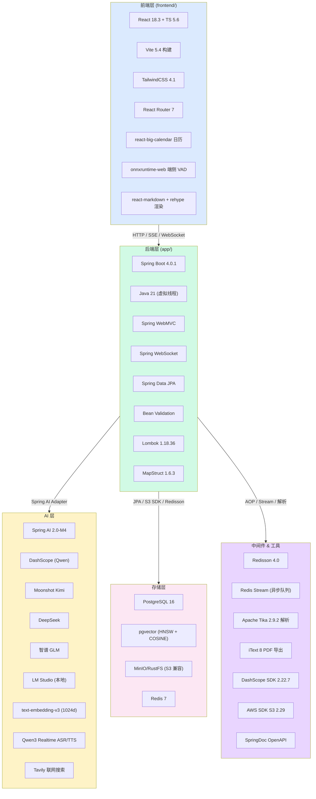
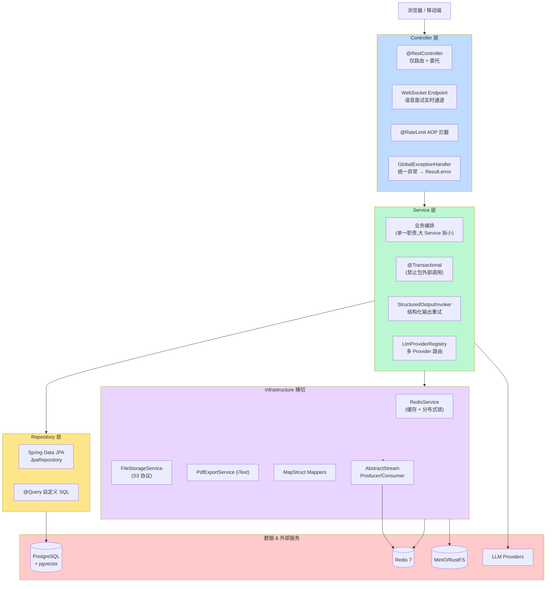
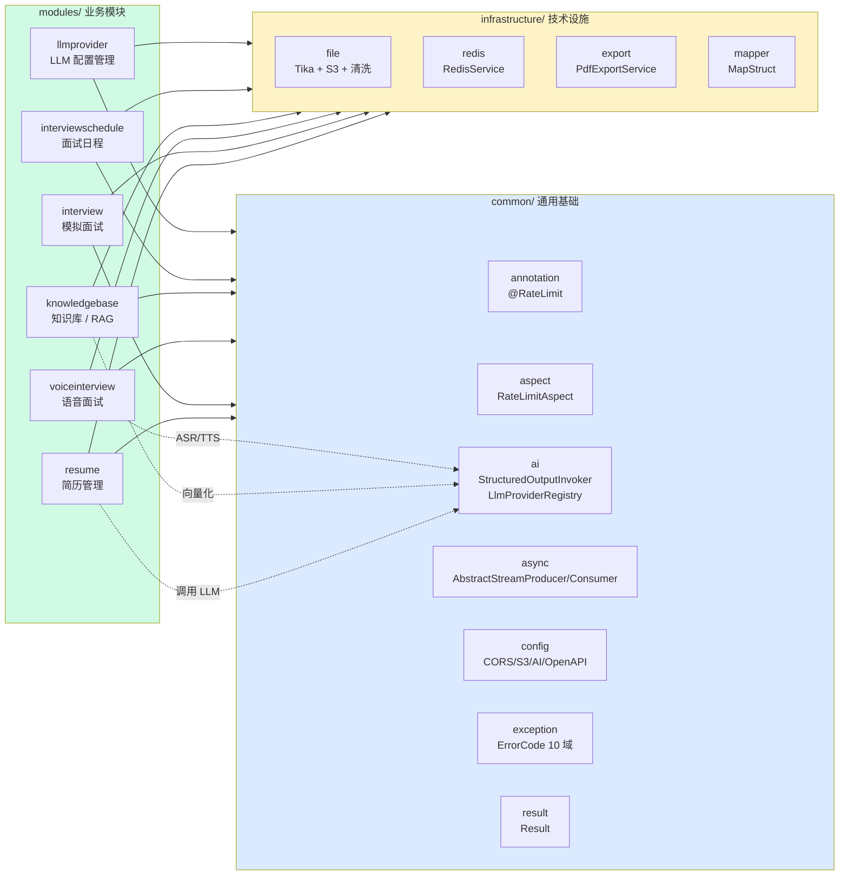
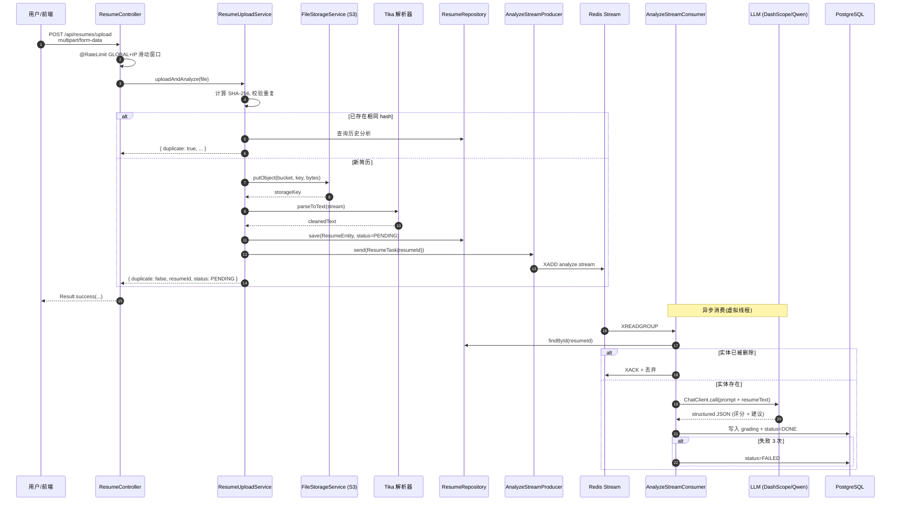
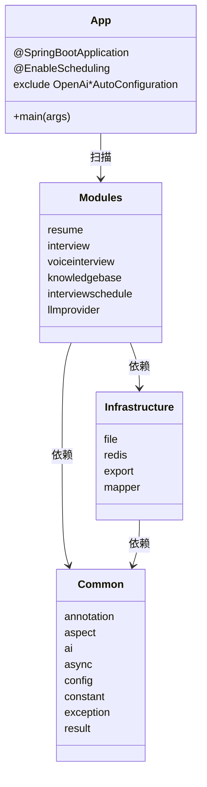
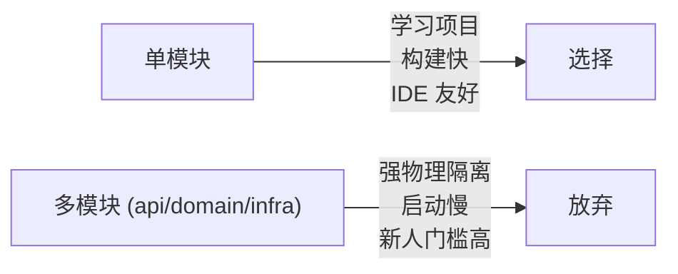
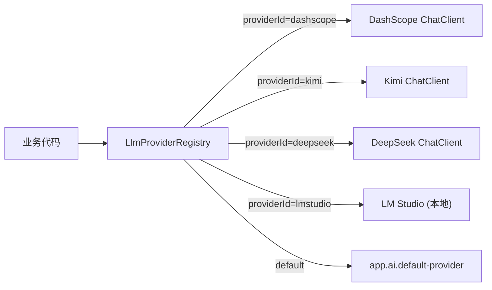
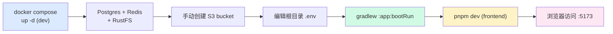
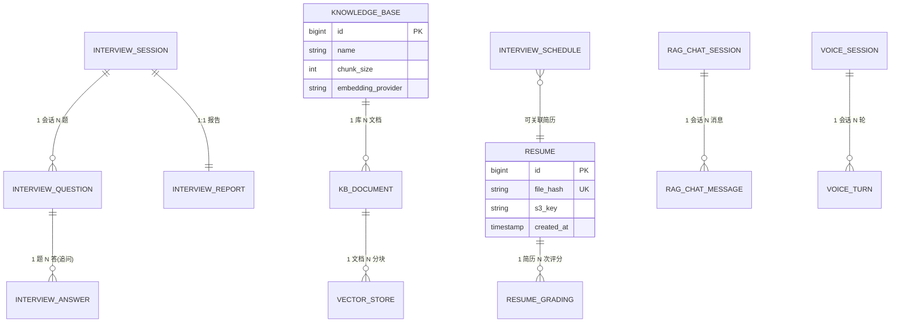

# 第 01 篇：架构设计与技术栈

> 本篇是 AI 面试 RAG 系统系列教程的开篇,用一张张图把"项目长什么样、为什么这么长"讲清楚,后续所有篇章都建立在本篇的术语之上。

---

## 1. 项目愿景与定位

**一句话**:一个集"简历智能解析、模拟面试出题、语音实时面试、RAG 知识问答、面试日程管理"于一体的 AI 全栈学习/实战平台。

定位差异:

| 维度 | 本项目 | 普通 Demo |
|------|--------|-----------|
| 技术栈深度 | Spring Boot 4 + Java 21 虚拟线程 + Spring AI 2.0-M4 | Spring Boot 3 + 单一 LLM SDK |
| AI 能力广度 | LLM Chat / Embedding / ASR / TTS / RAG / 结构化输出 | 只调 Chat 接口 |
| 工程化程度 | 限流、异步流、错误码分域、多 Provider 热切换 | 一把梭 |
| 真实场景 | 简历 → 出题 → 语音面试 → 评估 → PDF 报告 闭环 | 单功能 |

---

## 2. 技术栈全景图

> 一图看完前后端、AI、存储、中间件五大栈。颜色按层划分。



关键版本(`gradle/libs.versions.toml`):

| 组件 | 版本 | 备注 |
|------|------|------|
| Spring Boot | 4.0.1 | 模块化 starter,如 `spring-boot-starter-webmvc` |
| Spring AI | 2.0.0-M4 | 里程碑版,需 `repo.spring.io/milestone` |
| Java | 21 | 虚拟线程主力 |
| Redisson | 4.0.0 | 与 Boot 4.0 兼容 |
| MapStruct | 1.6.3 | 必须配在 Lombok 之后 |
| iText | 8.0.5 | PDF + font-asian 中文 |
| DashScope SDK | 2.22.7 | 阿里百炼 ASR/TTS |

---

## 3. 整体分层架构

> 经典三层 + 基础设施横切。所有业务模块都遵循这套骨架。



**铁律(摘自 `CLAUDE.md`)**:

- Controller 不写业务,只做路由 + 限流 + 参数校验
- Service 是业务编排单元,事务在这一层,**禁止**事务内调外部 API
- Repository 只关心持久化,不知道任何业务概念
- 跨层数据用 DTO/Request/Response,**禁止**把 Entity 暴露给前端
- 所有异常统一走 `BusinessException(ErrorCode.X)`,由全局处理器转成 `Result.error`

---

## 4. 模块划分

> 5 大业务模块 + 1 个 LLM Provider 管理模块,横向共享 common 和 infrastructure。



**模块一句话职责**:

| 模块 | 职责 | 关键入口 |
|------|------|----------|
| `resume` | 上传简历(PDF/DOCX/TXT),Tika 解析,AI 评分,重复检测,PDF 报告导出 | `ResumeController` |
| `interview` | 模拟面试会话:AI 出题、追问、答题、批量评估、生成报告 | `InterviewController` |
| `voiceinterview` | WebSocket 实时语音面试:Qwen3 ASR/TTS + 多阶段(intro/tech/project/hr)流程 | `controller/` + `handler/` |
| `knowledgebase` | 知识库文档上传 + 分块向量化(pgvector) + RAG 查询 + 多轮聊天会话 | `KnowledgeBaseController`、`RagChatController` |
| `interviewschedule` | 面试日程日历管理,AI 解析邮件/文本邀请自动建日程 | `InterviewScheduleController` |
| `llmprovider` | 运行时增删改查 LLM Provider 配置(API Key、模型、Base URL) | `controller/` |

`common` 与 `infrastructure` 的边界:**common = 业务无关的通用约定与抽象**(异常、注解、AOP、结果包装);**infrastructure = 具体技术实现的封装**(Redis 客户端、S3 客户端、Tika 解析器、PDF 渲染)。

---

## 5. 核心数据流:简历上传 → AI 解析 → 存储

> 选最典型场景演示"前端 → 限流 → 文件存储 → Tika → 异步 Stream → LLM → DB" 全链路。



**关键细节**:

1. **快返 + 异步**:HTTP 接口在解析完成前就返回,LLM 评分走 Redis Stream 异步,前端轮询/SSE 拿结果
2. **虚拟线程加持**:`spring.threads.virtual.enabled=true`,消费者在虚拟线程池跑 LLM 调用,几千并发不再吃内存
3. **失败重试**:`AbstractStreamConsumer` 模板内置重试 3 次 → FAILED
4. **去重**:SHA-256 文件指纹做幂等

---

## 6. 包结构说明



| 包路径 | 职责 | 典型类 |
|--------|------|--------|
| `interview.rag.system` | 启动入口 | `App` |
| `common.annotation` | 自定义注解 | `@RateLimit` |
| `common.aspect` | AOP 切面 | `RateLimitAspect` |
| `common.ai` | AI 通用基础 | `StructuredOutputInvoker`、`LlmProviderRegistry` |
| `common.async` | 异步流模板 | `AbstractStreamProducer/Consumer` |
| `common.config` | Spring 配置类 | `CorsConfig`、`S3Config`、`OpenApiConfig`、`LlmProviderConfig` |
| `common.constant` | 常量 | `AsyncTaskStreamConstants` |
| `common.exception` | 错误码 + 业务异常 | `ErrorCode`、`BusinessException`、`GlobalExceptionHandler` |
| `common.result` | 统一响应 | `Result<T>` |
| `infrastructure.file` | 文件上传 + 解析 | `FileStorageService`、`TikaFileParseService` |
| `infrastructure.redis` | Redis 封装 | `RedisService` |
| `infrastructure.export` | 导出 | `PdfExportService` |
| `infrastructure.mapper` | DTO 映射 | `ResumeMapper`、`InterviewMapper` |
| `modules.{name}` | 业务模块,自带 `Controller/service/repository/model/listener` | `ResumeController` 等 |

---

## 7. 关键设计决策与权衡

> 每条决策只回答两个问题:**为什么选它**、**放弃了什么**。

### 7.1 单模块 Gradle vs. 多模块



`settings.gradle` 只 `include('app')`,所有代码在 `app/src/main/java` 下用包结构隔离。规模到 10 万行以前不需要拆模块。

### 7.2 Java 21 虚拟线程

```yaml
# application.yml
spring:
  threads:
    virtual:
      enabled: true
```

**为什么**:本项目大量场景是 I/O 密集——LLM 调用、S3 上传、SSE 长连接、WebSocket 语音流。虚拟线程让"每个请求一个线程"重新可行,无需用 Reactor/WebFlux 把代码全翻成函数式。

**权衡**:目前部分库(Redisson 旧版、某些 native 锁)对 pinning 不友好,需关注 carrier thread 阻塞。

### 7.3 pgvector vs. 独立向量库 (Milvus/Qdrant)

| 维度 | pgvector | Milvus/Qdrant |
|------|----------|---------------|
| 部署 | 1 个 Postgres 容器 | 额外集群 |
| 事务一致性 | 与业务表强一致 | 需要双写 |
| 性能上限 | 千万级 | 亿级 |
| RAG 场景适配 | 完美 | 完美 |

**选 pgvector**:在百万文档以内的中小型 RAG 完全够用,运维成本几乎为零。配置在 `application.yml`:

```yaml
spring.ai.vectorstore.pgvector:
  index-type: HNSW
  distance-type: COSINE_DISTANCE
  dimensions: 1024
  initialize-schema: true
```

### 7.4 Redis Stream vs. Kafka/RabbitMQ

| 场景 | Redis Stream | Kafka |
|------|--------------|-------|
| 单机 QPS | 万级 | 十万级 |
| 顺序保证 | 单 stream 内有序 | 分区有序 |
| 运维 | 已有 Redis,零新增 | ZooKeeper + Broker 集群 |
| 消费组 | 内置 XGROUP | 内置 |

**为什么 Stream**:本项目异步任务是"分钟级低频高耗时"(LLM 评分),不是"毫秒级高频低耗时"(日志),Stream 完全胜任,且省一套中间件。模板:`AbstractStreamProducer/Consumer`。

### 7.5 多 LLM Provider 注册中心



**为什么**:`App.java` 故意 `exclude` 了所有 `OpenAi*AutoConfiguration`,自己接管。这样可以:

- 同一份代码,运行时按用户选择切换厂商
- A/B 测试不同模型效果
- 本地开发用 LM Studio 零成本调试

配置在 `app.ai.providers.*`,默认 `app.ai.default-provider=dashscope`。

### 7.6 结构化输出重试 `StructuredOutputInvoker`

LLM 返回 JSON 经常不合规(多了 markdown 围栏、字段缺失)。封装一层重试:

```yaml
app.ai:
  structured-max-attempts: 2
  structured-include-last-error: true   # 把上次错误塞进 Prompt 让模型修正
  structured-retry-use-repair-prompt: true
```

避免在业务代码里到处 `try { JSON.parse } catch`,统一处理。

---

## 8. 开发环境快速启动

### 8.1 先决条件

| 工具 | 版本 |
|------|------|
| JDK | 21+ |
| Node.js | 20+ |
| pnpm | 10+ |
| Docker Desktop | 最新 |

### 8.2 启动依赖容器

仅起 Postgres / Redis / RustFS,不跑后端容器,方便本地调试:

```powershell
# Windows PowerShell
docker compose -f docker-compose.dev.yml up -d
```

容器一览:

| 服务 | 端口 | 用途 |
|------|------|------|
| postgres (pgvector/pg16) | 5432 | 业务库 + 向量库 |
| redis 7 | 6379 | 缓存 + Stream |
| rustfs | 9000 / 9001 | S3 对象存储(API / Console) |

首次启动后,浏览器访问 `http://localhost:9001`,用 `rustfsadmin/rustfsadmin` 登录,**手动创建 bucket `interview-rag-system`**。

### 8.3 配置 .env

在仓库根目录建 `.env`(参考 `.env.example`),最少需要:

```env
# 阿里百炼 API Key(用于 Qwen Chat + Embedding + ASR/TTS)
AI_BAILIAN_API_KEY=sk-xxxxxxxxxxxxxxxx
AI_MODEL=qwen3.5-flash

# Postgres
POSTGRES_HOST=localhost
POSTGRES_PORT=5432
POSTGRES_DB=interview_guide
POSTGRES_USER=postgres
POSTGRES_PASSWORD=123456

# Redis
REDIS_HOST=localhost
REDIS_PORT=6379

# S3 (RustFS 本地)
APP_STORAGE_ENDPOINT=http://localhost:9000
APP_STORAGE_ACCESS_KEY=rustfsadmin
APP_STORAGE_SECRET_KEY=rustfsadmin
APP_STORAGE_BUCKET=interview-rag-system
```

`build.gradle` 的 `bootRun` 任务会自动把 `.env` 注入到进程环境变量。

### 8.4 启动后端

```powershell
# 项目根目录
.\gradlew :app:bootRun
```

访问:

- API: `http://localhost:8080`
- Swagger UI: `http://localhost:8080/swagger-ui.html`
- 健康检查:`http://localhost:8080/actuator/health` (如已开启)

### 8.5 启动前端

```powershell
cd frontend
pnpm install
pnpm dev
```

默认 `http://localhost:5173`,CORS 已在 `application.yml` 中放行(`5173/5174/80`)。

### 8.6 启动流程图



### 8.7 一键全栈(可选)

```powershell
# 把前后端一起容器化跑(生产模拟)
docker compose up -d --build
```

走 `docker-compose.yml`,会用 MinIO 替代 RustFS,前端 80 端口暴露。

---

## 9. 数据模型总览(预告)

> 完整 ER 图留到《第 03 篇 数据库与持久化》详解,这里先给"哪些表归哪个模块"的高阶视图。



---

## 10. 下一步

读完本篇,你应该能回答:

- [ ] 项目分成哪几层、每层职责是什么
- [ ] 6 个模块各自做什么
- [ ] 为什么选 pgvector、Redis Stream、虚拟线程
- [ ] 怎么把本地环境跑起来

**下一篇预告**:《第 02 篇 通用基础设施 —— 异常、限流、统一响应、AOP》将深入 `common/` 包,讲解 `Result<T>`、`ErrorCode` 分域、`@RateLimit` AOP + Lua 脚本、`GlobalExceptionHandler` 的设计与源码。
