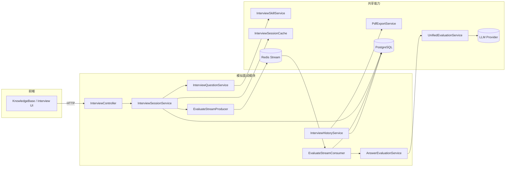
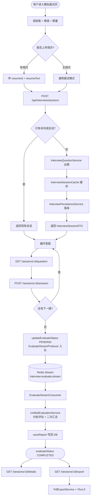
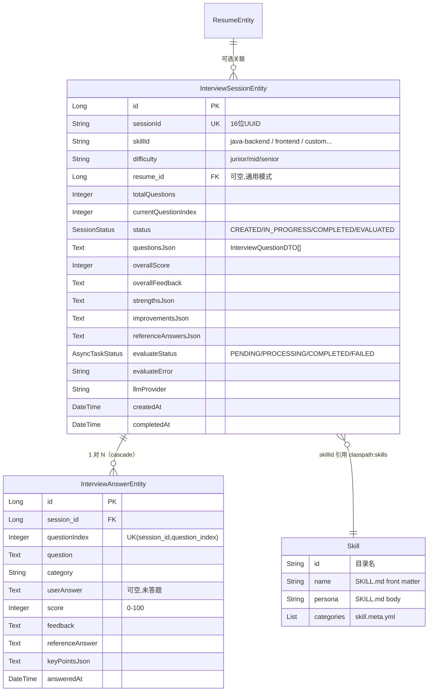
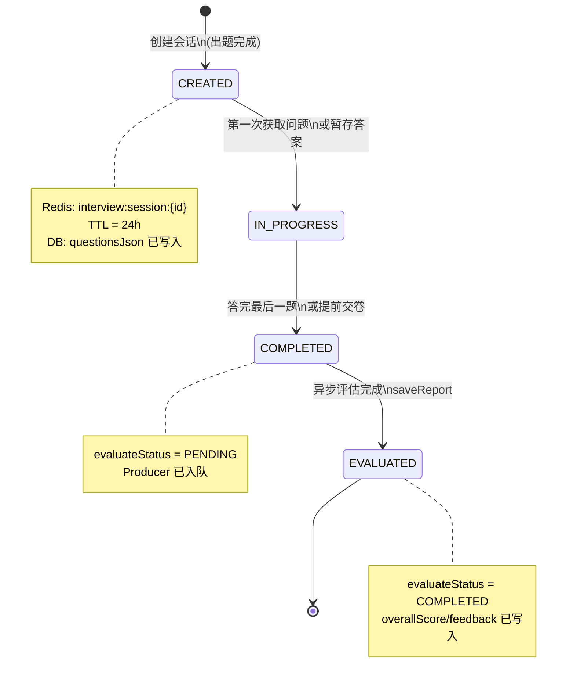
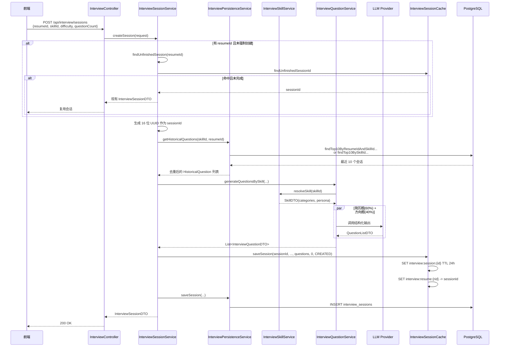
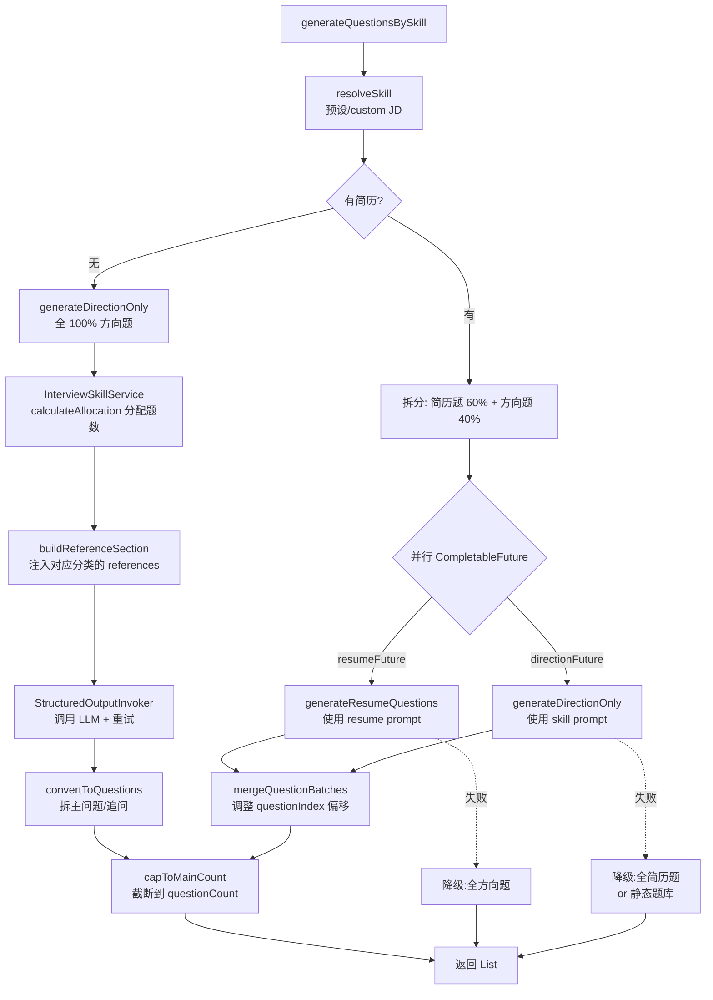
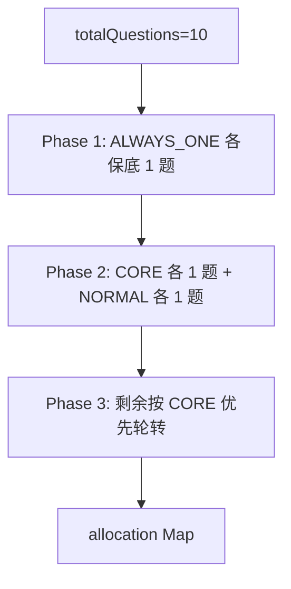
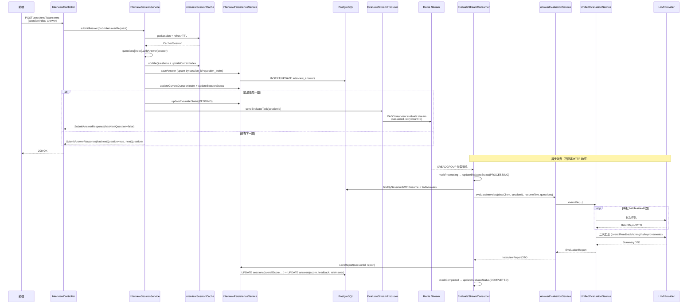

# 第 5 篇 模拟面试模块实现

> 面向中级 Java/AI 工程师，目标是讲清"会话管理 → AI 出题 → 答题评估 → 报告导出"这条主链路在本仓库的真实落地。
>
> 配套源码路径：`app/src/main/java/interview/rag/system/modules/interview/`、`app/src/main/java/interview/rag/system/common/evaluation/`、`app/src/main/java/interview/rag/system/infrastructure/export/PdfExportService.java`、`app/src/main/resources/prompts/`、`app/src/main/resources/skills/`

---

## 1. 模块概览与业务流程

### 1.1 在系统中的角色

模拟面试模块是平台对外的核心业务之一。和它强相关的有三个"邻居"：

- **简历模块（resume）**：作为出题素材输入，可选。无简历时退化为"通用面试模式"。
- **技能体系（skill）**：从 `classpath:skills/*/SKILL.md` 加载，决定出题方向、分类权重和参考资料。
- **共享评估服务（common/evaluation）**：`UnifiedEvaluationService` 是文字面试和语音面试共用的评估引擎，文字面试通过 `AnswerEvaluationService` 做一层 DTO 适配。



### 1.2 完整业务流程

下图把"创建 → 答题 → 评估 → 导出"四个阶段串到一起。注意评估是异步的，由 `EvaluateStreamConsumer` 在后台完成，前端通过 `evaluateStatus` 字段轮询结果。



### 1.3 实体关系



### 1.4 会话状态机



---

## 2. 面试会话管理

### 2.1 InterviewSessionService 职责

`InterviewSessionService`（位于 `app/src/main/java/interview/rag/system/modules/interview/service/InterviewSessionService.java`）是会话生命周期的中枢。从依赖列表（第 42-48 行）就能看出它的协调角色：

```java
// app/src/main/java/interview/rag/system/modules/interview/service/InterviewSessionService.java:42
private final InterviewQuestionService questionService;
private final AnswerEvaluationService evaluationService;
private final InterviewPersistenceService persistenceService;
private final InterviewSessionCache sessionCache;
private final ObjectMapper objectMapper;
private final EvaluateStreamProducer evaluateStreamProducer;
private final LlmProviderRegistry llmProviderRegistry;
```

它对外暴露的核心动作：

| 方法 | 说明 | 关键路径 |
|------|------|----------|
| `createSession` | 创建会话；若已有未完成会话直接复用 | `InterviewSessionService.java:55` |
| `getSession` / `getCurrentQuestion` | 优先 Redis → 缓存未命中从 DB 恢复并回填 | `InterviewSessionService.java:120 / 263` |
| `submitAnswer` | 提交答案、推进 currentIndex；最后一题触发异步评估 | `InterviewSessionService.java:292` |
| `saveAnswer` | 暂存答案，不推进 currentIndex | `InterviewSessionService.java:359` |
| `completeInterview` | 提前交卷，触发异步评估 | `InterviewSessionService.java:400` |
| `findUnfinishedSession` | 按 resumeId 查找未完成会话（先 Redis 后 DB） | `InterviewSessionService.java:139` |
| `generateReport` | 同步评估降级路径（正常走异步） | `InterviewSessionService.java:450` |

### 2.2 Redis 会话缓存设计

`InterviewSessionCache`（`app/src/main/java/interview/rag/system/infrastructure/redis/InterviewSessionCache.java`）封装了两类 key：

```java
// InterviewSessionCache.java:35
private static final String SESSION_KEY_PREFIX = "interview:session:";
private static final String RESUME_SESSION_KEY_PREFIX = "interview:resume:";
private static final Duration SESSION_TTL = Duration.ofHours(24);
```

| Key | 值类型 | 用途 | TTL |
|-----|--------|------|-----|
| `interview:session:{sessionId}` | `CachedSession`（序列化） | 完整会话数据：题目 JSON + currentIndex + status | 24h |
| `interview:resume:{resumeId}` | `String`（sessionId） | 简历到"未完成"会话的反向映射 | 24h |

`CachedSession` 的字段（`InterviewSessionCache.java:51-84`）值得注意——题目列表存的是序列化好的 JSON 字符串而不是 List 对象。这样 Redis 反序列化更稳定（不会因 record 字段变更炸掉），代价是每次 `getQuestions()` 都要做一次 JSON 反序列化。

**淘汰与刷新**：

- 每次读操作（`getOrRestoreSession`）都会调用 `refreshSessionTTL` 把 24h 刷新一次，相当于"滑动窗口"。
- 会话 `COMPLETED/EVALUATED` 时，`updateSessionStatus` 会主动删掉 `interview:resume:*` 反向映射（`InterviewSessionCache.java:124-136`），避免下次进入还命中"未完成会话"。

### 2.3 为什么"进行中走 Redis，完成后落库"

代码层面的事实是：**进行中和完成都同时写 Redis 与 DB**，只是有侧重。

- **进行中**：每次 `submitAnswer`/`saveAnswer` 都先更 Redis 缓存（同步），再写 DB（`try/catch` 兜底，DB 失败不阻塞用户）。
- **完成后**：异步评估 Consumer 仅依赖 DB 数据（`EvaluateStreamConsumer.java:106-125`），完全不再读 Redis。

权衡的原因：

| 维度 | Redis | DB |
|------|-------|-----|
| 答题响应时延 | 毫秒级，刷新 currentIndex 不要等磁盘 | JPA save 涉及事务、刷库 |
| 大字段开销 | `questionsJson` 一次序列化、原地更新 | `@Column(columnDefinition = "TEXT")` 每次 update 要重写整列 |
| 故障恢复 | 进程重启后 24h 内仍可恢复 | 唯一权威来源 |
| 跨进程查询 | 只能查"本会话"详情 | 列表、历史、统计都要走 DB |

所以模型本质是"**Redis 是热数据缓存 + 故障容忍，DB 是事实来源**"。代码里这样兜底（`InterviewSessionService.java:341-343`）：

```java
} catch (Exception e) {
    log.warn("保存答案到数据库失败: {}", e.getMessage());
}
```

> **踩坑提醒：Redis 会话过期**
> SESSION_TTL 是 24 小时。如果候选人离开后第二天回来继续答题，Redis 一定已经过期。代码靠 `restoreSessionFromDatabase`（`InterviewSessionService.java:180-188`）从 DB 把题目 JSON、已答题答案重新拼回 `CachedSession`，再写回 Redis。如果你修改了 `InterviewQuestionDTO` 的字段，记得给 record 加默认值或保留 Jackson 兼容字段，否则旧会话反序列化会炸。

### 2.4 创建会话时序图



---

## 3. AI 出题

### 3.1 出题流程

`InterviewQuestionService` 的核心是 `generateQuestionsBySkill`（`InterviewQuestionService.java:120-188`）。它有两种模式：



关键设计点：

1. **60/40 切分**（`InterviewQuestionService.java:50`）：`RESUME_QUESTION_RATIO = 0.6`。10 题 = 6 简历题 + 4 方向题。
2. **虚拟线程并行**（`InterviewQuestionService.java:102`）：`Executors.newVirtualThreadPerTaskExecutor()` 跑两路 LLM 调用，Java 21 虚拟线程几乎零开销。
3. **降级链**（`InterviewQuestionService.java:160-187`）：简历题失败 → 全方向题；方向题失败 → 全简历题；两个都失败 → `generateFallbackQuestions` 静态兜底。
4. **追问展开**（`InterviewQuestionService.java:326-332`）：LLM 返回的每个主问题可附带 `followUps`，被展平为同列表里 `isFollowUp=true` 的连续元素，`parentQuestionIndex` 指向主问题。

### 3.2 Prompt 模板

模板路径由 `InterviewQuestionProperties` 配置（`InterviewQuestionProperties.java:13-16`）：

```java
private String questionSystemPromptPath = "classpath:prompts/interview-question-skill-system.st";
private String questionUserPromptPath = "classpath:prompts/interview-question-skill-user.st";
private String resumeQuestionSystemPromptPath = "classpath:prompts/interview-question-resume-system.st";
private String resumeQuestionUserPromptPath = "classpath:prompts/interview-question-resume-user.st";
```

**方向题 system prompt 摘录**（`app/src/main/resources/prompts/interview-question-skill-system.st`）：

```text
# Question Generation Standards (出题标准)
1. **技术链条追问**：使用经验 → 核心原理 → 边界/优化
2. **难度分布要求**：基础 30% / 进阶 50% / 专家 20%

# Constraints (重要约束)
- 每道题目必须具有区分度
- 每个主问题都必须提供追问，写入 followUps 字段
- type 字段必须使用给定的分类 key
- **数量硬性要求**：questions 数组的长度必须严格等于 questionCount
```

**user prompt** 填充的核心变量（`InterviewQuestionService.java:236-244`）：

```java
variables.put("questionCount", questionCount);
variables.put("followUpCount", followUpCount);
variables.put("difficultyDescription", difficultyDesc);
variables.put("skillName", skill.name());
variables.put("skillDescription", skill.description() != null ? skill.description() : "");
variables.put("allocationTable", allocationTable);
variables.put("historicalSection", historicalSection);
variables.put("referenceSection", skillService.buildReferenceSection(skill, allocation));
variables.put("jdSection", buildJdSection(skill.sourceJd()));
```

### 3.3 结构化输出

通过 `StructuredOutputInvoker` + `BeanOutputConverter<QuestionListDTO>` 落地（`InterviewQuestionService.java:78`、`208-211`）：

```java
QuestionListDTO dto = structuredOutputInvoker.invoke(
    questionClient, systemPrompt, userPrompt, outputConverter,
    ErrorCode.INTERVIEW_QUESTION_GENERATION_FAILED,
    "简历题生成失败：", "简历题", log);
```

`StructuredOutputInvoker` 会拼接 `{format}` JSON Schema 到 system prompt 末尾，并按 `app.ai.structured-max-attempts`（默认 2）重试。重试时还可以把上次解析错误注入提示词（`structured-include-last-error`）。

### 3.4 防重复：HistoricalQuestion

`HistoricalQuestion`（`HistoricalQuestion.java`）非常简单：

```java
public record HistoricalQuestion(String question, String type, String topicSummary) {}
```

`InterviewPersistenceService.getHistoricalQuestions`（`InterviewPersistenceService.java:321-357`）取最近 10 个相关会话，解出主问题（过滤掉 `isFollowUp=true` 的追问），按 `question` 去重后限制为 60 条。

注入 prompt 时按 `type` 分组（`InterviewQuestionService.java:404-427`）：

```text
已考过的知识点（避免重复出题）：
- MYSQL: MySQL 索引失效场景, MySQL 事务隔离级别
- REDIS: Redis RDB/AOF 持久化对比
- JAVA: HashMap 扩容机制
```

> **踩坑提醒：出题不稳定**
> LLM 偶尔会返回少于 `questionCount` 的题目。`capToMainCount`（`InterviewQuestionService.java:341-365`）只能截断不能补全。如果你看到日志 `AI 生成主问题不足: 请求=10, 实际=7`，先升 `structured-max-attempts` 或把 `interview-question-skill-system.st` 里的"数量硬性要求"重申一遍。如果模型还是不听话，加一个补题循环或者直接切到能力更强的 Provider。

### 3.5 配置项一览

```yaml
# application.yml
app:
  interview:
    follow-up-count: ${APP_INTERVIEW_FOLLOW_UP_COUNT:1}   # 每个主问题的追问数 (0-2)
    evaluation:
      batch-size: ${APP_INTERVIEW_EVALUATION_BATCH_SIZE:8} # 评估分批大小
```

代码里还有几个硬编码常量值得留意（`InterviewQuestionService.java`）：

- `MAX_FOLLOW_UP_COUNT = 2`：追问上限
- `RESUME_QUESTION_RATIO = 0.6`：简历题占比
- `GENERIC_FALLBACK_QUESTIONS`：6 题静态兜底库

---

## 4. 技能体系（Skill）

### 4.1 目录结构

```text
app/src/main/resources/skills/
├── _shared/
│   └── references/         # 跨技能共享的参考资料
│       ├── java.md
│       ├── mysql.md
│       ├── redis.md
│       ├── spring.md
│       ├── system-design-scenarios.md
│       ├── javascript.md
│       ├── react-vue.md
│       └── ... (共 19 个 markdown)
├── java-backend/
│   ├── SKILL.md           # front matter + persona body
│   └── skill.meta.yml     # displayName + display + categories
├── frontend/
├── algorithm/
├── ai-agent-dev/
├── ali-backend/
├── bytedance-backend/
├── java-backend-tencent/
├── python-backend/
├── system-design/
└── test-development/
```

`SKILL.md` 的结构（以 `java-backend` 为例）：

```markdown
---
name: java-backend
description: 用于 Java 后端面试出题；优先围绕 Java 核心、MySQL、Redis、Spring...
---
# Overview
你是一位 Java 后端面试官...

# Instructions
1. 优先结合候选人简历和项目经历提问
2. 提问顺序遵循：使用经验 -> 原理机制 -> 边界条件 -> 优化与故障
...
```

`skill.meta.yml`：

```yaml
displayName: Java 后端开发
display:
  icon: ☕
  gradient: from-blue-500 to-indigo-500
  iconBg: bg-blue-100 dark:bg-blue-900/30
  iconColor: text-blue-600 dark:text-blue-400
categories:
  - key: JAVA
    label: Java
    priority: CORE
    ref: java.md
    shared: true
  - key: MYSQL
    label: MySQL
    priority: CORE
    ref: mysql.md
    shared: true
  - key: PROJECT
    label: 项目经历
    priority: ALWAYS_ONE
```

### 4.2 InterviewSkillService 加载机制

`@PostConstruct void loadPresetSkills`（`InterviewSkillService.java:92-118`）在启动时扫描 `classpath:skills/*/SKILL.md`，对每个目录：

1. 提取 `skillId`（目录名）
2. 解析 front matter → `SkillFrontMatterDefinition`（name、description）
3. 读取 markdown body → 作为 `persona`，供 LLM 角色扮演
4. 读取同目录 `skill.meta.yml` → `displayName`、`display`、`categories`
5. 注册到 `presetRegistry`（TreeMap，按 ID 排序）

启动完成后还会构建两个索引（`InterviewSkillService.java:120-133`、`218-246`）：

- `categoryRefIndex`：`category key → (ref 文件名, 是否 shared, 来源 skillId)`，给 JD 解析时做"模型推荐 ref → 本地映射纠正"用。
- `cachedReferenceFileList`：所有可用参考文件的 Markdown 表格，注入到 JD 解析 system prompt 让模型挑选。

### 4.3 技能与出题的关联

`calculateAllocation`（`InterviewSkillService.java:252-315`）按三档优先级分配题数：



`buildReferenceSection`（`InterviewSkillService.java:328-334`）则把分配到题的分类的参考资料拼到 user prompt：

```java
// custom 模式下非 shared 的 ref 要查原始 skillId 拼路径
String effectiveSkillId = skill.id();
if (CUSTOM_SKILL_ID.equals(skill.id()) && !category.shared() && category.ref() != null) {
    RefMapping mapping = categoryRefIndex.get(category.key());
    if (mapping != null) {
        effectiveSkillId = mapping.sourceSkillId();
    }
}
String referenceContent = loadReferenceContent(effectiveSkillId, category.ref(), category.shared());
```

`shared=true` 的会在 `classpath:skills/_shared/references/` 找，`shared=false` 才回到 `classpath:skills/{skillId}/references/`。整体被截断到 `MAX_REFERENCE_SECTION_CHARS = 12000` 防止 prompt 过长。

> **踩坑提醒：JD 自定义技能 reference 路径**
> 当用户 POST `/api/interview/skills/parse-jd` 提交 JD，LLM 会返回 `categories[].ref`（试图匹配文件名）。但 LLM 可能猜错 `shared` 字段。`buildCustomSkill`（`InterviewSkillService.java:153-180`）会查本地 `categoryRefIndex` 纠正，这是为什么自定义技能也能正确加载参考资料的原因。如果你新增了 ref 文件但忘记在某个预设 SKILL 的 `skill.meta.yml` 里登记，`categoryRefIndex` 不会有这一项，自定义技能就拿不到这个 ref。

---

## 5. 答题与异步评估

### 5.1 提交答案时序



### 5.2 EvaluateStreamProducer / Consumer 协作

二者继承自 `AbstractStreamProducer<T>` / `AbstractStreamConsumer<T>` 模板，模块对接代码非常薄。

**Producer**（`EvaluateStreamProducer.java`）核心 12 行：

```java
@Override
protected String streamKey() {
    return AsyncTaskStreamConstants.INTERVIEW_EVALUATE_STREAM_KEY;
}

@Override
protected Map<String, String> buildMessage(String sessionId) {
    return Map.of(
        AsyncTaskStreamConstants.FIELD_SESSION_ID, sessionId,
        AsyncTaskStreamConstants.FIELD_RETRY_COUNT, "0"
    );
}

@Override
protected void onSendFailed(String sessionId, String error) {
    updateEvaluateStatus(sessionId, AsyncTaskStatus.FAILED, truncateError(error));
}
```

**Consumer**（`EvaluateStreamConsumer.java:104-134`）业务核心：

```java
@Override
protected void processBusiness(EvaluatePayload payload) {
    String sessionId = payload.sessionId();
    Optional<InterviewSessionEntity> sessionOpt = sessionRepository.findBySessionIdWithResume(sessionId);
    if (sessionOpt.isEmpty()) {
        log.warn("会话已被删除，跳过评估任务: sessionId={}", sessionId);
        return;  // 直接 ACK 丢弃，符合"实体不存在直接消费"约定
    }

    InterviewSessionEntity session = sessionOpt.get();
    List<InterviewQuestionDTO> questions = objectMapper.readValue(
        session.getQuestionsJson(), new TypeReference<>() {});

    List<InterviewAnswerEntity> answers = persistenceService.findAnswersBySessionId(sessionId);
    for (InterviewAnswerEntity answer : answers) {
        int index = answer.getQuestionIndex();
        if (index >= 0 && index < questions.size()) {
            InterviewQuestionDTO question = questions.get(index);
            questions.set(index, question.withAnswer(answer.getUserAnswer()));
        }
    }

    String provider = session.getLlmProvider();
    ChatClient chatClient = llmProviderRegistry.getChatClientOrDefault(provider);
    String resumeText = session.getResume() != null ? session.getResume().getResumeText() : "";
    InterviewReportDTO report = evaluationService.evaluateInterview(chatClient, sessionId, resumeText, questions);
    persistenceService.saveReport(sessionId, report);
}
```

注意 `findBySessionIdWithResume` 用 `LEFT JOIN FETCH` 一次性带出简历，避免 lazy 加载在虚拟线程里炸 N+1。

### 5.3 评估流程

`UnifiedEvaluationService.evaluate`（`UnifiedEvaluationService.java:107-144`）做三件事：

1. **截断输入**：简历 > 3000 字符截断，referenceContext > 6000 字符截断
2. **分批评估**：每批 `batch-size=8` 题，调用 `interview-evaluation-{system,user}.st`
3. **二次汇总**：把所有批次结果拼起来，再调一次 `interview-evaluation-summary-{system,user}.st`，得到统一的 `overallFeedback`、`strengths`、`improvements`

**为什么要分批**：单次 LLM 上下文有限；20 题 + 简历 + 参考资料合在一起容易超 token，并且模型在长输入下评估质量下降。

**为什么要二次汇总**：分批评估的 `overallFeedback` 是各自的 8 题视角，不统一。二次汇总让模型基于"类别得分概览 + 高亮题目"重新输出一个全局视角的总评。

降级链（`UnifiedEvaluationService.java:248-280`）：

- 二次汇总失败 → 用 `mergeOverallFeedback` / `mergeListItems` 的批次聚合结果兜底
- 批次内某题没返回 → `mergeQuestionEvaluations` 用 0 分占位（`UnifiedEvaluationService.java:202-222`）

### 5.4 评分维度与报告结构

System prompt（`interview-evaluation-system.st`）规定的评分维度：

| 维度 | 权重 | 评估标准 |
|------|------|---------|
| 准确性 | 40% | 技术概念是否描述正确，无事实性错误 |
| 完整性 | 20% | 是否覆盖核心知识点，无重要遗漏 |
| 深度 | 25% | 是否触及底层源码、并发模型、性能优化或设计原理 |
| 表达 | 15% | 逻辑是否严密，陈述是否清晰，是否有条理 |

分数区间：90-100 优秀 / 75-89 良好 / 60-74 及格 / 40-59 不及格 / 0-39 较差。**无效回答（"不知道""跳过"）必须给 0 分**——这是 prompt 末尾的硬性约束。

`EvaluationReport` → `InterviewReportDTO` 通过 `AnswerEvaluationService.toInterviewReportDTO`（`AnswerEvaluationService.java:77-97`）一对一映射：

| 字段 | 说明 |
|------|------|
| `sessionId` | 会话 ID |
| `totalQuestions` | 题目总数 |
| `overallScore` | 已答题加权平均，未答全为 0 时整体为 0 |
| `categoryScores` | 按 category 聚合，含平均分和题数 |
| `questionDetails` | 每题 score + feedback |
| `overallFeedback` | 二次汇总后的全局评语 |
| `strengths` / `improvements` | 各 3-6 条，去重并限 8 条 |
| `referenceAnswers` | 每题参考答案 + keyPoints |

### 5.5 重试与失败处理

`AbstractStreamConsumer` 模板提供了 `MAX_RETRY_COUNT = 3` 的重试机制（`AsyncTaskStreamConstants.java:30`）。`EvaluateStreamConsumer.retryMessage`（`EvaluateStreamConsumer.java:147-166`）的实现是"重新入队"：

```java
@Override
protected void retryMessage(EvaluatePayload payload, int retryCount) {
    try {
        Map<String, String> message = Map.of(
            FIELD_SESSION_ID, sessionId,
            FIELD_RETRY_COUNT, String.valueOf(retryCount)
        );
        redisService().streamAdd(STREAM_KEY, message, STREAM_MAX_LEN);
    } catch (Exception e) {
        updateEvaluateStatus(sessionId, FAILED, truncateError("重试入队失败: " + e.getMessage()));
    }
}
```

> **踩坑提醒：异步评估幂等**
> Consumer 处理同一个 sessionId 多次会发生什么？`saveReport`（`InterviewPersistenceService.java:168-244`）的逻辑是：先 update Session 的统计字段，再按 `questionIndex` upsert Answer。**结果是幂等的，但代价是会重复跑 LLM 评估和重复 update 数据库**。如果你担心成本，可以在 `processBusiness` 起始处加一段：
> ```java
> if (session.getEvaluateStatus() == AsyncTaskStatus.COMPLETED) {
>     log.info("评估已完成，跳过重复执行: sessionId={}", sessionId);
>     return;
> }
> ```
> 但要注意 retry 场景下 status 还是 PROCESSING，所以这个判断只能挡掉"Producer 同一 sessionId 发了多次"的场景。

---

## 6. 历史查询与报告

### 6.1 历史列表与详情

`InterviewHistoryService.getInterviewDetail`（`InterviewHistoryService.java:38-74`）流程：

1. 从 DB 查 `InterviewSessionEntity`（带 answers）
2. 用 `ObjectMapper` 解析所有 JSON 字段（`questionsJson`、`strengthsJson`、`improvementsJson`、`referenceAnswersJson`）
3. **构建完整答案列表**——这是关键：`buildAnswerDetailList`（`InterviewHistoryService.java:80-120`）会遍历"原始题目列表"，对于用户没答的题也补一个空答案进去，前端能完整显示所有题。
4. 用 `InterviewMapper.toDetailDTO`（MapStruct）组装最终 DTO

`InterviewDetailDTO`（`InterviewDetailDTO.java`）的字段一目了然：sessionId、status、evaluateStatus、overallScore、overallFeedback、questions/strengths/improvements/referenceAnswers/answers。`AnswerDetailDTO` 单独封装每题的"问题 + 用户答案 + 评分 + 反馈 + 参考答案 + keyPoints"。

### 6.2 PDF 导出流程

```mermaid
flowchart TD
    Start[GET /sessions/:id/export] --> Find[findBySessionId]
    Find -->|不存在| Err1[BusinessException<br/>INTERVIEW_SESSION_NOT_FOUND]
    Find -->|存在| Pdf[PdfExportService.exportInterviewReport]

    Pdf --> Font[createChineseFont<br/>读 fonts/ZhuqueFangsong-Regular.ttf]
    Font -->|缺失| Err2[BusinessException<br/>EXPORT_PDF_FAILED]
    Font -->|成功| Doc[new Document + setFont]

    Doc --> Title[渲染"模拟面试报告"标题]
    Title --> Info[面试信息：sessionId / 题数 / 状态 / 时间]
    Info --> Score[综合评分：彩色 overallScore]
    Score --> Feedback[总体评价: overallFeedback]
    Feedback --> Str[表现优势 strengthsJson]
    Str --> Imp[改进建议 improvementsJson]
    Imp --> Loop[遍历 answers]

    Loop --> QA[问题 N [category]<br/>Q: question<br/>A: userAnswer 或"未回答"<br/>得分: score/100<br/>评价: feedback<br/>参考答案: referenceAnswer]
    QA --> Loop

    Loop --> Close[document.close]
    Close --> Return[byte[] → Controller<br/>Content-Disposition attachment]
```

关键代码（`PdfExportService.java:50-67`）：

```java
private PdfFont createChineseFont() {
    try (var fontStream = getClass().getClassLoader()
            .getResourceAsStream("fonts/ZhuqueFangsong-Regular.ttf")) {
        if (fontStream != null) {
            byte[] fontBytes = fontStream.readAllBytes();
            return PdfFontFactory.createFont(fontBytes,
                PdfEncodings.IDENTITY_H, EmbeddingStrategy.FORCE_EMBEDDED);
        }
        throw new BusinessException(ErrorCode.EXPORT_PDF_FAILED, "字体文件缺失，请联系管理员");
    } catch (BusinessException e) {
        throw e;
    } catch (Exception e) {
        throw new BusinessException(ErrorCode.EXPORT_PDF_FAILED, "创建字体失败: " + e.getMessage());
    }
}
```

要点：

- **字体**：`app/src/main/resources/fonts/ZhuqueFangsong-Regular.ttf`（朱雀仿宋）。`PdfEncodings.IDENTITY_H` 是 Unicode 编码，`FORCE_EMBEDDED` 把字体嵌入 PDF（保证任何 Reader 都能正常渲染）。
- **文本清洗**：`sanitizeText`（`PdfExportService.java:72-76`）剔除 emoji 和代理字符，避免 iText 抛 `MissingGlyphException`。
- **得分颜色**：`getScoreColor`（`PdfExportService.java:295-299`）按 80/60 划分绿/黄/红。
- **Controller 编码**（`InterviewController.java:163-172`）：

```java
String filename = URLEncoder.encode("模拟面试报告_" + sessionId + ".pdf",
    StandardCharsets.UTF_8);
return ResponseEntity.ok()
    .header(HttpHeaders.CONTENT_DISPOSITION, "attachment; filename*=UTF-8''" + filename)
    .contentType(MediaType.APPLICATION_PDF)
    .body(pdfBytes);
```

`filename*=UTF-8''` 是 RFC 5987 语法，让 Chrome、Firefox、Edge 都能正确显示中文文件名。

> **踩坑提醒：PDF 中文乱码**
> 不要相信 `PdfFontFactory.createFont(StandardFonts.HELVETICA)` 之类的内置字体，它们 **不支持中文**。如果不嵌入 TTF 字体，渲染结果是空白或方块。本仓库通过把字体打进 jar（`resources/fonts/`）解决，部署到任何环境都不依赖宿主机的字体集。
>
> 如果将来要替换字体（比如换成思源宋体），记得：
> 1. TTF 文件放到 `resources/fonts/`
> 2. 修改 `PdfExportService.createChineseFont` 的文件名
> 3. 字体许可证要允许嵌入（朱雀仿宋是 SIL OFL 协议）

---

## 7. 接口清单

### 7.1 面试相关 REST API

| Method | Path | 说明 | 限流 |
|--------|------|------|------|
| GET | `/api/interview/sessions` | 列出所有面试会话（轻量 SessionListItemDTO） | - |
| POST | `/api/interview/sessions` | 创建面试会话 | GLOBAL=5, IP=5 |
| GET | `/api/interview/sessions/{sessionId}` | 获取会话信息（Redis 优先） | - |
| GET | `/api/interview/sessions/{sessionId}/question` | 获取当前问题（推进 CREATED → IN_PROGRESS） | - |
| POST | `/api/interview/sessions/{sessionId}/answers` | 提交答案（推进到下一题；末题触发评估） | GLOBAL=10 |
| PUT | `/api/interview/sessions/{sessionId}/answers` | 暂存答案（不推进 currentIndex） | - |
| POST | `/api/interview/sessions/{sessionId}/complete` | 提前交卷（触发评估） | - |
| GET | `/api/interview/sessions/{sessionId}/report` | 同步生成评估报告（异步失败时的兜底） | - |
| GET | `/api/interview/sessions/{sessionId}/details` | 获取面试详情（含完整 Q&A） | - |
| GET | `/api/interview/sessions/{sessionId}/export` | 导出 PDF 报告 | - |
| GET | `/api/interview/sessions/unfinished/{resumeId}` | 查找该简历的未完成会话 | - |
| DELETE | `/api/interview/sessions/{sessionId}` | 删除会话（级联删 answers） | - |

### 7.2 技能管理 REST API

| Method | Path | 说明 | 限流 |
|--------|------|------|------|
| GET | `/api/interview/skills` | 列出所有预设技能 | - |
| GET | `/api/interview/skills/{id}` | 获取单个技能详情（含 categories、persona） | - |
| POST | `/api/interview/skills/parse-jd` | 通过 LLM 解析 JD，提取 3-7 个考察方向 | IP=5 |

### 7.3 请求/响应示例

**创建会话**：

```http
POST /api/interview/sessions
Content-Type: application/json

{
  "resumeId": 123,
  "resumeText": "...",
  "questionCount": 8,
  "skillId": "java-backend",
  "difficulty": "mid",
  "llmProvider": "dashscope",
  "forceCreate": false
}
```

```json
{
  "code": 0,
  "data": {
    "sessionId": "a1b2c3d4e5f6g7h8",
    "totalQuestions": 12,
    "currentQuestionIndex": 0,
    "status": "CREATED",
    "questions": [
      {
        "questionIndex": 0,
        "question": "请介绍你最近做过的一个项目的整体架构。",
        "type": "PROJECT",
        "category": "项目经历",
        "topicSummary": "项目整体架构",
        "isFollowUp": false,
        "parentQuestionIndex": null
      },
      {
        "questionIndex": 1,
        "question": "基于...，如果线上出现 OOM，你会如何定位？",
        "type": "PROJECT",
        "category": "项目经历（追问1）",
        "isFollowUp": true,
        "parentQuestionIndex": 0
      }
    ]
  }
}
```

> 注意 `totalQuestions` 是 12 而不是 8——因为每个主问题展开了 1 个追问（`followUpCount=1`），所以 8 主 + 8 追问理论上是 16，但 `capToMainCount` 只控制主问题数，且 LLM 可能未严格输出 8 个主问题。前端应该用 `questions.length` 而不是请求时的 `questionCount` 渲染进度条。

**提交答案**：

```http
POST /api/interview/sessions/a1b2c3d4e5f6g7h8/answers
Content-Type: application/json

{
  "questionIndex": 0,
  "answer": "我们采用了微服务架构，核心服务有..."
}
```

```json
{
  "code": 0,
  "data": {
    "hasNextQuestion": true,
    "nextQuestion": { "questionIndex": 1, "question": "...", ... },
    "currentIndex": 1,
    "totalQuestions": 12
  }
}
```

末题提交后：

```json
{
  "code": 0,
  "data": {
    "hasNextQuestion": false,
    "nextQuestion": null,
    "currentIndex": 12,
    "totalQuestions": 12
  }
}
```

此时 `evaluateStatus` 会从 `null` → `PENDING` → `PROCESSING` → `COMPLETED`。前端可以轮询 `GET /api/interview/sessions` 或 `/details` 拿状态。

---

## 8. 小结与延伸

本模块的关键设计可以浓缩为四句话：

1. **会话用 Redis 兜热路径，DB 兜事实来源**：Redis 失效不致命，能从 DB 完整重建 `CachedSession`。
2. **出题用并行 + 降级**：简历题 + 方向题并行调 LLM，单路失败时降级；都失败时走静态兜底库。
3. **评估走 Redis Stream + 分批 + 二次汇总**：HTTP 不阻塞，模型不超 token，全局视角统一。
4. **PDF 嵌入字体保中文**：朱雀仿宋打进 jar，部署不依赖宿主机字体。

如果你要拓展这个模块，几个值得动手的方向：

- **流式出题反馈**：现在出题是阻塞的（虚拟线程内 join），可以在 Controller 用 SSE 推送"已出 3/8 题"提升体验。
- **评估打点上报**：`structured-metrics-enabled` 是开着的，可以接 Prometheus 监控 LLM 调用成功率/时延。
- **题目难度自适应**：基于 `categoryScores` 反向调整下次出题的 `difficulty`，做闭环。
- **共享 Skill 注册中心**：当前 SKILL 是 classpath 静态加载，可以扩展成支持运行时热加载/数据库加载。
