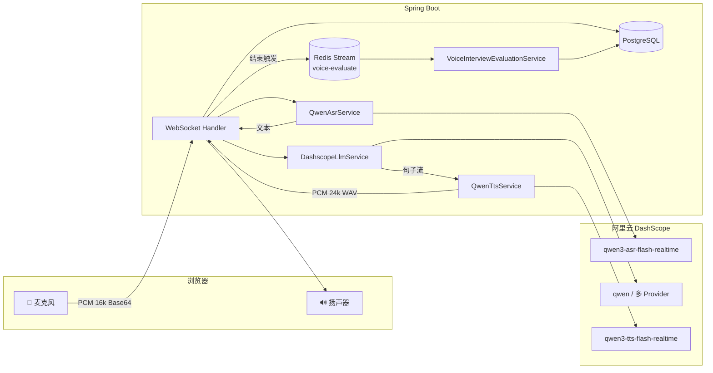
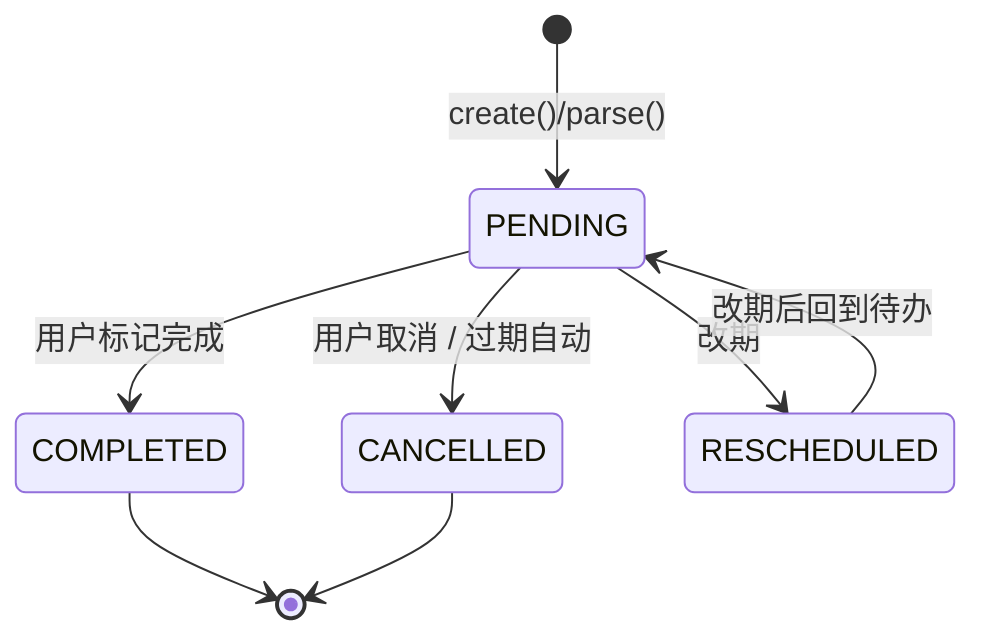
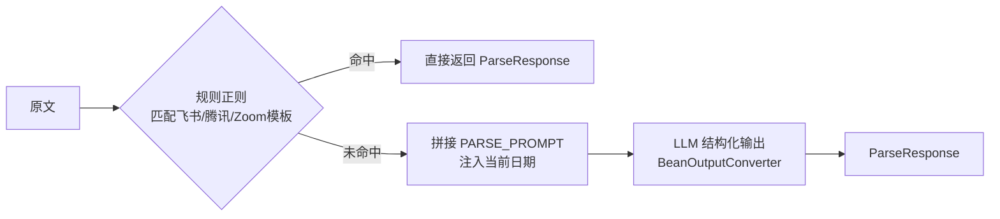
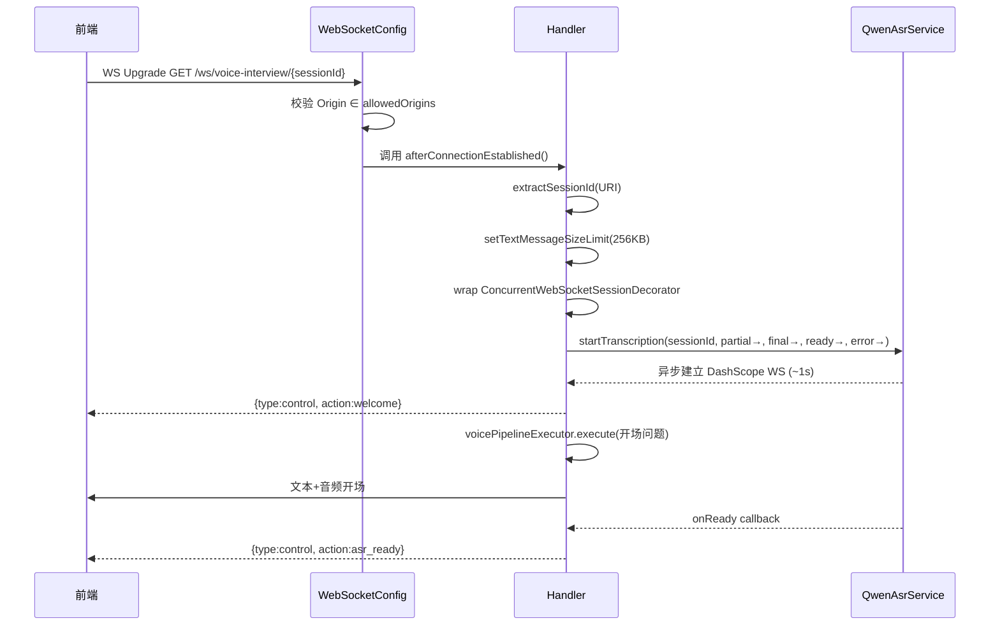
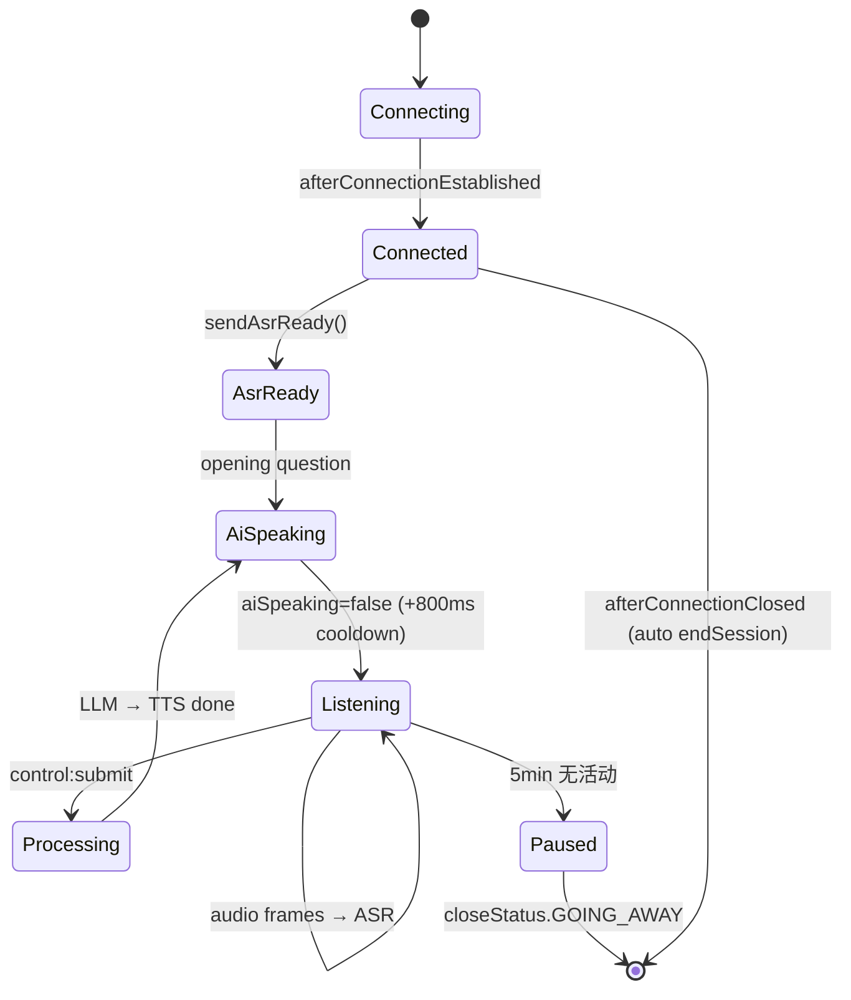
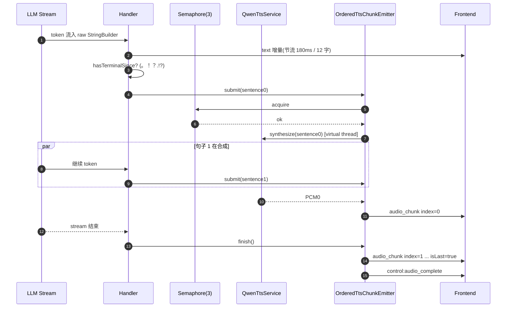
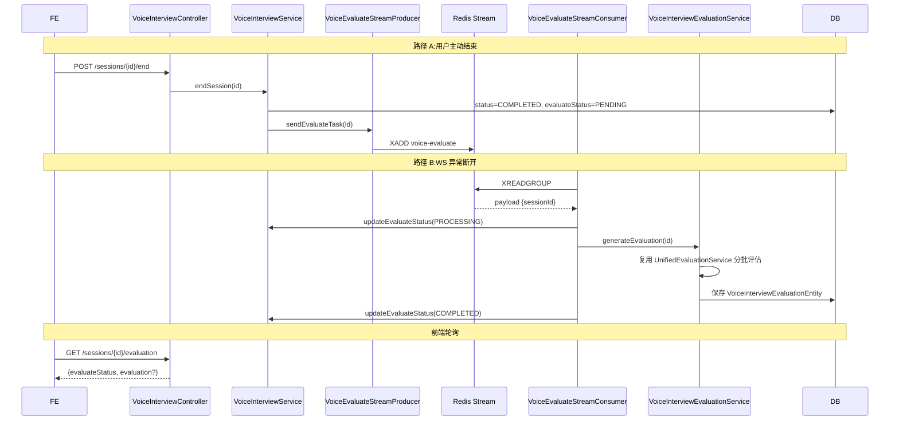

# 06 - 语音面试实现

> 系列教学文档第 6 篇，聚焦**代码实现细节**。
> 架构层文档参见 [voice-interview-architecture.md](voice-interview-architecture.md)；本篇不重复架构图，而是逐行讲清楚 WebSocket 处理器、ASR/TTS/LLM 三件套、虚拟线程管线、回声抑制、句子级 TTS 并发、异步评估等关键实现。

---

## 目录

1. [模块概览与差异](#1-模块概览与差异)
2. [面试日程 InterviewSchedule](#2-面试日程-interviewschedule)
3. [WebSocket 实时通话(核心)](#3-websocket-实时通话核心)
4. [ASR / TTS / LLM Provider](#4-asr--tts--llm-provider)
5. [多轮对话与角色扮演](#5-多轮对话与角色扮演)
6. [评估与报告](#6-评估与报告)
7. [API / WebSocket 端点清单](#7-api--websocket-端点清单)
8. [踩坑提醒汇总](#8-踩坑提醒汇总)
9. [本文相关源码索引](#9-本文相关源码索引)

---

## 1. 模块概览与差异

语音面试与文本面试(第 [05](05-面试模块实现.md) 篇)共享同一套技能体系、统一评估服务,但 I/O 通道完全不同 —— 它是一条**永远在跑的实时双向音频流**。



### 与文本面试的差异

| 维度 | 文本面试(05) | 语音面试(本篇) |
|---|---|---|
| 输入通道 | HTTP POST | WebSocket 二进制音频(PCM Base64) |
| 输出通道 | HTTP 响应 | WebSocket 文本帧 + 音频帧 |
| 出题方式 | 一次性预生成 N 道题 | 多轮对话式即兴生成 |
| 提问触发 | 用户主动 GET | 服务端开场+用户回答后追问 |
| 评分时机 | 单题评分 + 汇总 | 仅结束时整体评估(异步) |
| 阶段控制 | 客户端按题切换 | 服务端按 INTRO→TECH→PROJECT→HR 时长/题数推进 |
| 数据存储 | InterviewAnswer 每题一行 | 每轮 AI 提问/用户回答合并到一行(`voice_interview_messages`) |

---

## 2. 面试日程 InterviewSchedule

面试日程 (`/api/interview-schedule`) 是一个独立模块,负责管理「我什么时候有哪场真实面试」,与语音面试模块解耦但常被前端同页面展示。

### 2.1 状态机



四种状态枚举见 [InterviewStatus.java](app/src/main/java/interview/rag/system/modules/interviewschedule/model/InterviewStatus.java):

```java
public enum InterviewStatus {
    PENDING, COMPLETED, CANCELLED, RESCHEDULED
}
```

### 2.2 两种创建方式

#### 方式 A:手动表单创建

`POST /api/interview-schedule` + [CreateInterviewRequest](app/src/main/java/interview/rag/system/modules/interviewschedule/model/CreateInterviewRequest.java),走 [InterviewScheduleController.create()](app/src/main/java/interview/rag/system/modules/interviewschedule/InterviewScheduleController.java#L61-L66)。

#### 方式 B:粘贴一段邀约文本,AI 自动解析

`POST /api/interview-schedule/parse` + `ParseRequest{ rawText, source }`,内部走 [InterviewParseService.parse()](app/src/main/java/interview/rag/system/modules/interviewschedule/service/InterviewParseService.java)。**两段式策略**:



规则匹配是为了节省 Token,Service 内置了对飞书/腾讯会议/Zoom 三种平台模板的正则识别 [InterviewParseService.java:43-60](app/src/main/java/interview/rag/system/modules/interviewschedule/service/InterviewParseService.java#L43-L60)。规则未命中才调用 LLM。

Prompt 关键约束(节选自 `PARSE_PROMPT`):

```
3. interviewTime（面试时间）：提取面试开始时间并转换为 ISO 8601 格式，**必需字段**
   - 格式：YYYY-MM-DDTHH:MM:SS（例如：2026-04-10T14:00:00）
   - 若只有相对时间（如"明天下午2点"），根据当前日期 %s 推算
```

> ⚠️ **踩坑提醒**:LLM 在处理"明天/下周三"时会用自己的训练截止日期当"今天",必须把 `LocalDate.now()` 显式注入 Prompt,否则会算出 2024 年的日期。

### 2.3 过期自动取消

[ScheduleStatusUpdater](app/src/main/java/interview/rag/system/modules/interviewschedule/service/ScheduleStatusUpdater.java) 通过 `@Scheduled(cron = "0 0 * * * ?")` **每小时整点**扫一次,把 `interviewTime < now()` 且仍为 `PENDING` 的记录批量改为 `CANCELLED`,SQL 在 Repository 里是一条 `UPDATE ... WHERE` 语句,**不读出实体**。

```java
@Scheduled(cron = "0 0 * * * ?")
@Transactional
public void updateExpiredInterviews() {
    int updated = repository.updateStatusByStatusAndInterviewTimeBefore(
        InterviewStatus.CANCELLED, InterviewStatus.PENDING, LocalDateTime.now());
    if (updated > 0) {
        log.info("已将 {} 条过期面试标记为已取消", updated);
    }
}
```

> 💡 启用此 `@Scheduled` 需要 [App.java](app/src/main/java/interview/rag/system/App.java) 上的 `@EnableScheduling`。

---

## 3. WebSocket 实时通话(核心)

这是本模块最复杂的一段代码,核心都集中在 [VoiceInterviewWebSocketHandler.java](app/src/main/java/interview/rag/system/modules/voiceinterview/handler/VoiceInterviewWebSocketHandler.java) 约 1500 行。

### 3.1 端点注册与握手



注册在 [WebSocketConfig.java:24](app/src/main/java/interview/rag/system/modules/voiceinterview/config/WebSocketConfig.java#L24):

```java
registry.addHandler(voiceInterviewWebSocketHandler, "/ws/voice-interview/{sessionId}")
    .addInterceptors(new HttpSessionHandshakeInterceptor())
    .setAllowedOrigins(corsProperties.getAllowedOrigins().split(","));
```

> ⚠️ **踩坑提醒(WebSocket 跨域)**:`setAllowedOrigins` 是 **WebSocket 自己的 CORS 校验**,与 [CorsConfig](app/src/main/java/interview/rag/system/common/config/CorsConfig.java) 的 HTTP CORS **互不影响**。开发环境忘记把前端域名加进 `app.cors.allowed-origins` 会得到 403 握手失败,且浏览器控制台错误信息很隐蔽。

### 3.2 客户端 → 服务端消息

| type | 字段 | 含义 |
|---|---|---|
| `audio` | `data` (Base64 PCM 16k 16bit mono) | 麦克风音频帧,~32KB / 秒 |
| `control` | `action: "submit"`, `data.text?` | 用户点击"提交本轮回答",触发 LLM |
| `control` | `action: "end_interview"` | 结束面试,触发评估入队 |
| `control` | `action: "start_phase"`, `phase: "TECH"` | 切换面试阶段 |

控制消息映射见 [WebSocketControlMessage.java](app/src/main/java/interview/rag/system/modules/voiceinterview/dto/WebSocketControlMessage.java)。处理分发在 [VoiceInterviewWebSocketHandler.java:869-893](app/src/main/java/interview/rag/system/modules/voiceinterview/handler/VoiceInterviewWebSocketHandler.java#L869-L893)。

### 3.3 服务端 → 客户端消息

| type | 字段 | 含义 |
|---|---|---|
| `control` | `action: welcome` | 连接成功 |
| `control` | `action: asr_ready` | ASR 通道已建立,可以开始录音 |
| `control` | `action: asr_reconnecting` | ASR 自动重连中 |
| `control` | `action: audio_complete` | 流式 TTS 全部块已下发 |
| `control` | `action: pause_timeout_warning` | 5 分钟无活动,30 秒后将暂停 |
| `control` | `action: pause_timeout` | 已暂停 |
| `subtitle` | `text`, `isFinal` | 字幕 (实时部分文本 / 段落定稿) |
| `text` | `content`, `final` | 流式 LLM 输出 |
| `audio` | `data` (Base64 WAV 24k) | 完整 TTS 音频(非分块模式) |
| `audio_chunk` | `data`, `index`, `isLast` | 句子级分块 TTS(实时模式) |
| `error` | `message` | 错误反馈 |

JSON 示例:

```json
// 服务端 → 前端:实时字幕(用户正在说)
{"type":"subtitle","text":"我想介绍一下 Spring 的","isFinal":false}

// 服务端 → 前端:LLM 流式文本(增量)
{"type":"text","content":"好的，那你能","final":false}

// 服务端 → 前端:分块 TTS 第 0 段
{"type":"audio_chunk","data":"UklGRiQ...","index":0,"isLast":false}

// 客户端 → 服务端:提交本轮
{"type":"control","action":"submit","data":{"text":"已识别的最终文本"}}
```

### 3.4 连接生命周期



关键定时任务在 Handler 内,通过 `@Scheduled(fixedRate = 30000)` [checkPauseTimeout()](app/src/main/java/interview/rag/system/modules/voiceinterview/handler/VoiceInterviewWebSocketHandler.java#L1127-L1145):

```java
private static final long WARNING_TIME_MS  = (long)(4.5 * 60 * 1000);  // 4:30
private static final long PAUSE_TIMEOUT_MS = 5 * 60 * 1000;            // 5:00
```

每 30 秒扫描 `lastActivityTime`,4:30 发警告,5:00 触发 [handlePauseTimeout()](app/src/main/java/interview/rag/system/modules/voiceinterview/handler/VoiceInterviewWebSocketHandler.java#L1179-L1211):落库为 PAUSED → 关闭 WS → 清理 ASR 通道 → 移除 maps。

### 3.5 异常断开兜底

[afterConnectionClosed()](app/src/main/java/interview/rag/system/modules/voiceinterview/handler/VoiceInterviewWebSocketHandler.java#L367-L393) 会自动结束 IN_PROGRESS 会话,防止状态卡住:

```java
try {
    interviewService.endSessionIfInProgress(sessionId);
} catch (Exception endEx) {
    log.warn("Failed to auto-end session {} after disconnect: {}", sessionId, endEx.getMessage());
}
```

### 3.6 关键调度:两个线程池

[VoiceInterviewWebSocketHandler.java:70-75](app/src/main/java/interview/rag/system/modules/voiceinterview/handler/VoiceInterviewWebSocketHandler.java#L70-L75) 同时持有两个线程池:

```java
/** 仅 2 个调度线程,用于 debounce 合并与 ASR 健康检查的定时任务 */
private final ScheduledExecutorService utteranceMergeScheduler = createUtteranceMergeScheduler();

/** LLM/TTS/JDBC 全部阻塞工作跑在虚拟线程,不能占用上面的调度线程 */
private final ExecutorService voicePipelineExecutor = Executors.newVirtualThreadPerTaskExecutor();
```

> 💡 **设计要点**:`ScheduledThreadPoolExecutor` 只有 2 个线程,如果在调度回调里直接调 LLM,整个会话集群就会被卡死。虚拟线程承担所有 LLM/TTS/DB I/O,完美匹配 Java 21 的 `newVirtualThreadPerTaskExecutor()`。

### 3.7 ASR 自动重连

ASR 通道偶尔会因网络抖动失效,Handler 实现了 3 层防御:

```mermaid
flowchart TD
    A[handleUserAudio收到帧] --> B{ASR 是否 ready?}
    B -->|未 ready| C[丢弃帧 + log debug]
    B -->|ready| D[sttService.sendAudio]
    D -->|抛 IllegalStateException| E{shouldRecover?}
    E -->|是 "No active session"| F[restartDashScopeStt]
    F --> G[重试 15 次×80ms]
    G -->|成功| H[继续]
    G -->|失败| I[sendError 刷新页面]
    E -->|否| J[抛出]
```

代码见 [handleUserAudio()](app/src/main/java/interview/rag/system/modules/voiceinterview/handler/VoiceInterviewWebSocketHandler.java#L480-L537) 与 [scheduleAsrReadyCheck()](app/src/main/java/interview/rag/system/modules/voiceinterview/handler/VoiceInterviewWebSocketHandler.java#L429-L454)。

### 3.8 防回声(扬声器尾音抑制)

**问题**:扬声器播 AI 音频时,麦克风会拾取到这段音频,触发 ASR 把 AI 说的话识别成"用户说的",引发死循环。

**解法**:`SessionState.aiSpeaking` + `aiSpeakEndAt` 双标志,AI 说话期间 + 结束后 800ms 内**直接丢弃**麦克风帧:

```java
// VoiceInterviewWebSocketHandler.java:489-491
if (state != null && state.isAiSpeakingOrCooldown()) {
    return;
}
```

`AI_SPEAK_COOLDOWN_MS = 800` 是经验值,见 [VoiceInterviewWebSocketHandler.java:89](app/src/main/java/interview/rag/system/modules/voiceinterview/handler/VoiceInterviewWebSocketHandler.java#L89)。

### 3.9 STT 合并 buffer

多次 VAD 切段(用户说一句话被 VAD 切成 2-3 个 final segment)需要拼接才能给 LLM 用,实现在 `SessionState` 内:

- `appendFinalSttSegment()` 把段落智能合并,见 [joinSegments()](app/src/main/java/interview/rag/system/modules/voiceinterview/handler/VoiceInterviewWebSocketHandler.java#L1393-L1408):
  - 重复/前缀:取较长者
  - 上一句以句号结尾:用空格连
  - 否则:用中文逗号连
- `getMergeBufferPreviewWithPartial()` 在字幕上**叠加**当前 partial,实时显示"已确认 + 正在说"

只有客户端发 `submit` 才会 `takeMergeBufferAndClear()` 把累计文本提交给 LLM,见 [flushMergedUtteranceToLlm()](app/src/main/java/interview/rag/system/modules/voiceinterview/handler/VoiceInterviewWebSocketHandler.java#L575-L609)。

### 3.10 句子级 TTS 并发(核心优化)

朴素方案是 LLM 全部生成完才调 TTS,首音延迟 = LLM 总时长 + TTS 总时长。本系统在 **LLM 流式生成期间**,每检测到一个完整句子就丢给 `voicePipelineExecutor` 异步合成 TTS,显著降低首音延迟。



实现要点(见 [OrderedTtsChunkEmitter](app/src/main/java/interview/rag/system/modules/voiceinterview/handler/VoiceInterviewWebSocketHandler.java#L976-L1091)):

- 每会话 TTS 并发上限由 `app.voice-interview.max-concurrent-tts-per-session` 控制(默认 3),用 `Semaphore` 限流
- 提交顺序与 emit 顺序解耦:并发合成 + 按 `index` 顺序下发,保证音频连续
- 单句超时 `ttsTimeoutSeconds` 默认 8s,超时跳过该句不阻塞后续
- 全部失败时回退到一次性 `synthesize(完整文本)` 作兜底 [VoiceInterviewWebSocketHandler.java:756-770](app/src/main/java/interview/rag/system/modules/voiceinterview/handler/VoiceInterviewWebSocketHandler.java#L756-L770)

> ⚠️ **踩坑提醒**:`ConcurrentWebSocketSessionDecorator` 给每个 session 的发送加了缓冲区限制(512KB),分块时不会爆;但如果改回单条大音频且超过这个限制,会得到 `Send buffer full` 异常。本系统在 [VoiceInterviewWebSocketHandler.java:86-87](app/src/main/java/interview/rag/system/modules/voiceinterview/handler/VoiceInterviewWebSocketHandler.java#L86-L87) 显式设置。

### 3.11 PCM → WAV 的就地转换

DashScope TTS 返回的是裸 PCM (24kHz / 16bit / mono),浏览器 `<audio>` 标签不能直接播,需要补 44 字节 WAV 头。Handler 直接手写字节数组拼接以避开流分配开销 [convertPcmToWav()](app/src/main/java/interview/rag/system/modules/voiceinterview/handler/VoiceInterviewWebSocketHandler.java#L1301-L1339)。

---

## 4. ASR / TTS / LLM Provider

### 4.1 三件套配置

集中在 [VoiceInterviewProperties.java](app/src/main/java/interview/rag/system/modules/voiceinterview/config/VoiceInterviewProperties.java),从 `app.voice-interview.*` 前缀加载:

```yaml
app:
  voice-interview:
    qwen:
      asr:
        url: wss://dashscope.aliyuncs.com/api-ws/v1/realtime
        model: qwen3-asr-flash-realtime
        api-key: ${AI_BAILIAN_API_KEY}
        language: zh
        format: pcm
        sample-rate: 16000
        enable-turn-detection: true
        turn-detection-type: server_vad
        turn-detection-silence-duration-ms: 1000   # 默认 1s 静音切段
      tts:
        model: qwen3-tts-flash-realtime
        api-key: ${AI_BAILIAN_API_KEY}
        voice: Cherry
        format: pcm
        sample-rate: 24000
        mode: commit
        speech-rate: 1.0
        volume: 60

    # 单轮 AI 回复最大字符(超过会被截断到句子边界)
    ai-question-max-chars: 120
    # 是否启用 LLM 流式 + 句子级 TTS
    llm-streaming-enabled: true
    ai-stream-push-interval-ms: 180
    ai-stream-min-chars-delta: 12
    max-concurrent-tts-per-session: 3
    chunked-audio-enabled: true
    tts-timeout-seconds: 8
```

### 4.2 ASR:QwenAsrService

[QwenAsrService.java](app/src/main/java/interview/rag/system/modules/voiceinterview/service/QwenAsrService.java) 包装阿里 DashScope SDK `OmniRealtimeConversation`,关键设计:

- 每个面试会话一个 `OmniRealtimeConversation` 实例,存在 `ConcurrentHashMap<String, AsrSession> sessions`
- 4 个回调注入到 SDK:`onPartial / onFinal / onReady / onError`,全部由 Handler 提供
- 服务端 VAD (`server_vad`) 自动断句,业务无需处理静音判定
- `sessionLocks` 保证同一 sessionId 的 stop/start 串行,防止并发重连撕裂

### 4.3 TTS:QwenTtsService

[QwenTtsService.java](app/src/main/java/interview/rag/system/modules/voiceinterview/service/QwenTtsService.java) 包装 `QwenTtsRealtime`,关键设计:

- `synthesize(text)` 同步阻塞 API,内部用 `CountDownLatch` 等 30s 超时
- 模式固定 `commit`:文本发完后显式 commit 才触发合成
- PCM 24kHz / 16bit / mono,需配合 [convertPcmToWav()](app/src/main/java/interview/rag/system/modules/voiceinterview/handler/VoiceInterviewWebSocketHandler.java#L1301)
- 短文本(< 50 字)合成 < 200ms,长文本会有显著延迟,所以才有句子级并发优化

### 4.4 LLM:DashscopeLlmService

[DashscopeLlmService.java](app/src/main/java/interview/rag/system/modules/voiceinterview/service/DashscopeLlmService.java) **不是只对接 DashScope**,而是通过 [LlmProviderRegistry.getVoiceChatClient(provider)](app/src/main/java/interview/rag/system/common/ai/LlmProviderRegistry.java) 拿到 ChatClient,支持运行时切换 Provider(DashScope / OpenAI / MiniMax / DeepSeek / LM Studio …)。

两个核心方法:

| 方法 | 用途 | 返回 |
|---|---|---|
| `chat(userInput, session, history)` | 一次性获取完整回复 | `String aiReply` |
| `chatStreamSentences(userInput, onToken, onSentence, session, history)` | 流式 + 句子边界回调 | `String aiReply` (全文) |

[chatStreamSentences()](app/src/main/java/interview/rag/system/modules/voiceinterview/service/DashscopeLlmService.java#L69-L130) 的关键:

```java
chatClient.prompt()
    .system(promptContext.systemPrompt())
    .user(promptContext.userPrompt())
    .stream()                              // ← 流式
    .content()
    .doOnNext(token -> {
        raw.append(token);
        if (onSentence != null && hasTerminalSince(token)) {
            // 检测到句末标点 → 切出新句 → onSentence.accept(sentence)
        }
        // 节流推送 partial text 给前端
    })
```

`TERMINAL_PUNCTUATION = "。！？；!?;."` 是句子边界判定字符集。

### 4.5 LLM Provider 配置面板

[LlmProviderController.java](app/src/main/java/interview/rag/system/modules/llmprovider/controller/LlmProviderController.java) 提供完整 CRUD,前端"设置"页用此模块在线配置 Provider:

```
GET  /api/llm-provider/list                       # 列表
POST /api/llm-provider                            # 新增
PUT  /api/llm-provider/{id}                       # 更新
POST /api/llm-provider/{id}/test                  # 测连
POST /api/llm-provider/reload                     # 热重载到 LlmProviderRegistry
GET  /api/llm-provider/default-provider           # 当前默认
```

ASR/TTS 配置脱敏后返回前端,见 [AsrConfigDTO](app/src/main/java/interview/rag/system/modules/llmprovider/dto/AsrConfigDTO.java) 与 [TtsConfigDTO](app/src/main/java/interview/rag/system/modules/llmprovider/dto/TtsConfigDTO.java),`apiKey` 字段统一用 `maskedApiKey`(`sk-***xxxx`)避免泄漏。

---

## 5. 多轮对话与角色扮演

### 5.1 开场白(冷启动优化)

第一题不依赖 LLM,直接从 [voice-interview-opening.yml](app/src/main/resources/voice-interview-opening.yml) 按 `skillId` 选模板,**启动时预合成 TTS 缓存**:

```java
// VoiceInterviewWebSocketHandler.java:108-130
@PostConstruct
void warmupOpeningAudioCache() {
    voicePipelineExecutor.execute(() -> {
        // 把所有 opening template 提前调 TTS 合成、缓存到 openingAudioCache
        ...
        log.info("Opening audio cache warmed: {} entries", openingAudioCache.size());
    });
}
```

效果:第一个用户连接进来时,开场音频是从内存 Map 直接取的,无需现合成 → 首字延迟 ~50ms。

配置示例(节选):

```yaml
app:
  voice-interview:
    opening:
      skill-questions:
        java-backend: >
          你好，我是本场面试官。第一个问题：请用 1 分钟介绍一个你深度参与的后端项目...
        algorithm: >
          你好，我是本场面试官。第一个问题：请你口述一道算法题，不写代码...
      algorithm-skills:
        - bytedance-backend
        - algorithm
      algorithm-question: >  # 命中 algorithm-skills 时的兜底
        ...
      backend-question: >    # 其余兜底
        ...
```

`buildOpeningQuestion()` 决策树:精确匹配 `skillId` → 算法分类兜底 → 后端兜底 → 硬编码常量 [VoiceInterviewWebSocketHandler.java:276-300](app/src/main/java/interview/rag/system/modules/voiceinterview/handler/VoiceInterviewWebSocketHandler.java#L276-L300)。

### 5.2 角色 System Prompt

[VoiceInterviewPromptService.java](app/src/main/java/interview/rag/system/modules/voiceinterview/service/VoiceInterviewPromptService.java) 不直接拼大段 Prompt,而是**让 LLM 主动调用 Skill 工具加载完整角色定义**(节省 token,与文本面试共享技能体系):

```java
private static final String SKILL_TOOL_INSTRUCTION = """
        你是一位 %s 方向的面试官。
        如果尚未加载完整的角色设定，请调用 Skill 工具（command: %s）加载该技能的 SKILL.md。
        工具输出包含完整的面试官角色和出题规则，后续对话应基于该角色进行。
        """;
```

附加固定的**语音输出约束**(关键差异化):

```
【语音面试输出约束】
1. 每轮只问 1 个主问题，必要时最多补 1 个短追问。
2. 总长度控制在 2-4 句，避免长段落、列表、Markdown、代码块。
3. 不要重复开场白，不要复述上一轮已问过的完整问题。
4. 若候选人回答过短或含糊，直接追问一个具体的技术细节或给出提示引导，不要简单确认后停止。
5. 当候选人明确要求换题时，立即切换到新的技术方向，不要停留在当前话题。
6. 语气简洁直接，适配口语对话。
```

> 💡 这是适配语音对话的关键 —— LLM 默认会输出 Markdown 列表,在 TTS 里念出来非常出戏。

### 5.3 历史上下文拼接

[getHistory()](app/src/main/java/interview/rag/system/modules/voiceinterview/handler/VoiceInterviewWebSocketHandler.java#L1226-L1267) 把 DB 中按 sequence 排序的 messages 拼成:

```
面试官：第一个问题：请介绍...
候选人：好的，我做过一个...
面试官：那你能讲讲...
候选人：...
```

特别处理:**最后一条 AI 提问如果还没收到回答(pendingAiQuestion)**,会作为最后一行保留,作为当前轮的"问题上下文"喂给 LLM 生成追问。

### 5.4 简历上下文注入

如果会话关联了 resumeId,`VoiceInterviewPromptService.generateSystemPromptWithContext()` 会:

1. 用 `PromptSanitizer.sanitize()` 清洗简历文本(防 Prompt Injection)
2. 用 `wrapWithDelimiters("resume", ...)` 包裹分隔符
3. 拼到 system prompt 末尾,并附 `ANTI_INJECTION_INSTRUCTION` 防御指令

```java
prompt.append("\n\n【实时语音面试 - 候选人简历内容】\n")
    .append("你已查阅过候选人简历。首轮仅用一句话说明已查阅，并立即进入首个问题。\n\n")
    .append("【简历解析文本】\n")
    .append(promptSanitizer.wrapWithDelimiters("resume", safeResume));
```

---

## 6. 评估与报告

### 6.1 触发与状态机



### 6.2 数据结构

[VoiceInterviewEvaluationEntity](app/src/main/java/interview/rag/system/modules/voiceinterview/model/VoiceInterviewEvaluationEntity.java) 与文本面试评估对齐,所有结构化数据存 JSON TEXT:

| 字段 | 类型 | 含义 |
|---|---|---|
| `overallScore` | Integer | 整体评分 0-100 |
| `overallFeedback` | TEXT | 总体反馈 |
| `questionEvaluationsJson` | TEXT | 每题评估数组 JSON |
| `strengthsJson` | TEXT | 优势列表 JSON |
| `improvementsJson` | TEXT | 改进项列表 JSON |
| `referenceAnswersJson` | TEXT | 参考答案 JSON |

### 6.3 复用统一评估服务

关键设计:[VoiceInterviewEvaluationService.generateEvaluation()](app/src/main/java/interview/rag/system/modules/voiceinterview/service/VoiceInterviewEvaluationService.java#L52-L77) **复用** [UnifiedEvaluationService](app/src/main/java/interview/rag/system/common/evaluation/UnifiedEvaluationService.java)(详见 [02 篇](02-通用基础设施.md)),把 messages 转成 `List<QaRecord>` 后交给同一套分批 + 结构化输出 + 兜底逻辑:

```java
List<QaRecord> qaRecords = buildQaRecords(messages);
String provider = session.getLlmProvider();
ChatClient chatClient = llmProviderRegistry.getChatClientOrDefault(provider);
String referenceContext = skillService.buildEvaluationReferenceSectionSafe(session.getSkillId());

EvaluationReport report = unifiedEvaluationService.evaluate(
    chatClient, sessionIdStr, qaRecords, null, referenceContext);

saveEvaluationTransactional(sessionId, session, report);
```

> 💡 **复用而不是复制**:语音/文本面试结果格式统一,前端报告组件可以共用,极大简化了维护成本。

### 6.4 异步管道(共享 02 章模板)

[VoiceEvaluateStreamConsumer](app/src/main/java/interview/rag/system/modules/voiceinterview/listener/VoiceEvaluateStreamConsumer.java) 继承 `AbstractStreamConsumer<VoiceEvaluatePayload>`,只实现 7 个抽象方法:

| 方法 | 实现 |
|---|---|
| `streamKey()` | `voice-evaluate` (常量) |
| `parsePayload()` | 解出 `sessionId` 字段 |
| `markProcessing()` | `updateEvaluateStatus(PROCESSING)` |
| `processBusiness()` | `evaluationService.generateEvaluation(id)` |
| `markCompleted()` | `updateEvaluateStatus(COMPLETED)` |
| `markFailed()` | `updateEvaluateStatus(FAILED, error)` |
| `retryMessage()` | `XADD` 重新入队,带 retryCount |

> ⚠️ **踩坑提醒**:`retryMessage()` 的入队失败也要兜底为 `FAILED`,否则会卡在 `PROCESSING`。代码已正确处理 [VoiceEvaluateStreamConsumer.java:113-118](app/src/main/java/interview/rag/system/modules/voiceinterview/listener/VoiceEvaluateStreamConsumer.java#L113-L118)。

### 6.5 卡死自愈

[VoiceInterviewService.cleanupStaleSessions()](app/src/main/java/interview/rag/system/modules/voiceinterview/service/VoiceInterviewService.java#L647-L675) 每 5 分钟由 Handler 触发,负责:

- 把 IN_PROGRESS 但启动 > 2h 的会话强制结束(异常断电、浏览器崩溃)
- 把 PROCESSING 但 updatedAt > 30min 的评估改为 FAILED(LLM 卡死)

---

## 7. API / WebSocket 端点清单

### 7.1 REST API

| Method | 路径 | 说明 | 限流 |
|---|---|---|---|
| POST | `/api/voice-interview/sessions` | 创建会话(选技能、阶段开关) | - |
| GET | `/api/voice-interview/sessions/{id}` | 获取详情 | - |
| GET | `/api/voice-interview/sessions` | 列表(可按 status 过滤) | - |
| POST | `/api/voice-interview/sessions/{id}/end` | 结束并触发评估 | - |
| PUT | `/api/voice-interview/sessions/{id}/pause` | 暂停 | - |
| PUT | `/api/voice-interview/sessions/{id}/resume` | 恢复 | - |
| DELETE | `/api/voice-interview/sessions/{id}` | 删除(级联 messages + evaluation) | - |
| GET | `/api/voice-interview/sessions/{id}/messages` | 对话历史 | - |
| GET | `/api/voice-interview/sessions/{id}/evaluation` | 评估状态 + 结果 | - |
| POST | `/api/voice-interview/sessions/{id}/evaluation` | 重新触发评估 | - |
| POST | `/api/interview-schedule/parse` | AI 解析邀约文本 | - |
| POST | `/api/interview-schedule` | 创建面试日程 | - |
| GET | `/api/interview-schedule` | 列表(按时间/状态过滤) | - |
| GET/PUT/DELETE | `/api/interview-schedule/{id}` | 详情/更新/删除 | - |
| PATCH/PUT | `/api/interview-schedule/{id}/status` | 更新状态 | - |
| GET | `/api/llm-provider/list` | LLM Provider 列表 | GLOBAL=30 |
| POST | `/api/llm-provider` | 新增 Provider | GLOBAL=5 |
| POST | `/api/llm-provider/{id}/test` | 测连 | GLOBAL=10 |
| POST | `/api/llm-provider/reload` | 热重载注册中心 | GLOBAL=5 |

> Voice Interview 主接口未加 `@RateLimit`,因为 WebSocket 本身在 Handler 内有暂停超时和会话清理机制。如需对外开放可加 USER 维度限流。

### 7.2 WebSocket 端点

| 端点 | 协议 | 说明 |
|---|---|---|
| `ws://host:8080/ws/voice-interview/{sessionId}` | 文本帧 JSON | 双向音频流 + 控制 + 字幕 + TTS |

握手要求:
- Origin ∈ `app.cors.allowed-origins`
- sessionId 必须先通过 POST `/sessions` 创建
- 子协议:无(裸 WebSocket)

---

## 8. 踩坑提醒汇总

| # | 问题 | 解决 |
|---|---|---|
| 1 | **WebSocket 跨域**:HTTP CORS 配了不代表 WS 也配了 | 必须在 `app.cors.allowed-origins` 加前端域名,WS 走的是 [WebSocketConfig.setAllowedOrigins()](app/src/main/java/interview/rag/system/modules/voiceinterview/config/WebSocketConfig.java#L26) |
| 2 | **TTS 队列阻塞** | 单句 8s 超时 + 全部失败兜底完整文本 TTS,见 [VoiceInterviewWebSocketHandler.java:756-770](app/src/main/java/interview/rag/system/modules/voiceinterview/handler/VoiceInterviewWebSocketHandler.java#L756-L770) |
| 3 | **ASR 中英混合识别差** | Provider 配置 `language: zh`,如需中英混说改用 `language: auto`,代价是延迟略增 |
| 4 | **扬声器尾音被 ASR 拾取** | `aiSpeaking` + 800ms cooldown 双标志,期间丢弃麦克风帧 |
| 5 | **同类内调 `@Transactional` 不生效** | `VoiceInterviewService.endSession(String)` 调内部 `endSession(Entity)` 时,后者的事务在前者已开启的事务里继续,这里没问题;但若新加方法时拆分,要用自注入或 AOP 代理 |
| 6 | **LLM 解析"明天/下周三"算错日期** | `InterviewParseService` 把 `LocalDate.now()` 注入 Prompt 模板 `%s` |
| 7 | **`@Scheduled` 不触发** | App 上的 `@EnableScheduling` 必须存在 |
| 8 | **2 线程的 `ScheduledThreadPoolExecutor` 跑 LLM 直接卡死** | 严格分离:调度只做 debounce/health check,LLM/TTS 全跑 `voicePipelineExecutor` 虚拟线程 |
| 9 | **PCM 采样率不匹配** | ASR 收 16kHz,TTS 出 24kHz,前端 AudioContext 要分别处理 |
| 10 | **`ConcurrentWebSocketSessionDecorator` 缓冲区满** | 默认 512KB,大块音频要么分块 (`audio_chunk`),要么调大但有 OOM 风险 |

---

## 9. 本文相关源码索引

### 入口与配置

- [VoiceInterviewController.java](app/src/main/java/interview/rag/system/modules/voiceinterview/controller/VoiceInterviewController.java) — REST 入口
- [WebSocketConfig.java](app/src/main/java/interview/rag/system/modules/voiceinterview/config/WebSocketConfig.java) — WS 端点注册
- [VoiceInterviewProperties.java](app/src/main/java/interview/rag/system/modules/voiceinterview/config/VoiceInterviewProperties.java) — 全部配置 (`app.voice-interview.*`)
- [voice-interview-opening.yml](app/src/main/resources/voice-interview-opening.yml) — 按技能的开场白模板

### 核心 Handler 与 Service

- [VoiceInterviewWebSocketHandler.java](app/src/main/java/interview/rag/system/modules/voiceinterview/handler/VoiceInterviewWebSocketHandler.java) — **最重要**,1500 行实时管线
- [VoiceInterviewService.java](app/src/main/java/interview/rag/system/modules/voiceinterview/service/VoiceInterviewService.java) — 会话生命周期 + Redis 缓存 + 卡死自愈
- [VoiceInterviewPromptService.java](app/src/main/java/interview/rag/system/modules/voiceinterview/service/VoiceInterviewPromptService.java) — System Prompt 构造
- [DashscopeLlmService.java](app/src/main/java/interview/rag/system/modules/voiceinterview/service/DashscopeLlmService.java) — LLM 包装(流式 + 句子边界)
- [QwenAsrService.java](app/src/main/java/interview/rag/system/modules/voiceinterview/service/QwenAsrService.java) — ASR 包装
- [QwenTtsService.java](app/src/main/java/interview/rag/system/modules/voiceinterview/service/QwenTtsService.java) — TTS 包装

### 数据模型

- [VoiceInterviewSessionEntity.java](app/src/main/java/interview/rag/system/modules/voiceinterview/model/VoiceInterviewSessionEntity.java) — 会话主表
- [VoiceInterviewMessageEntity.java](app/src/main/java/interview/rag/system/modules/voiceinterview/model/VoiceInterviewMessageEntity.java) — 每轮对话
- [VoiceInterviewEvaluationEntity.java](app/src/main/java/interview/rag/system/modules/voiceinterview/model/VoiceInterviewEvaluationEntity.java) — 评估结果
- [VoiceInterviewSessionStatus.java](app/src/main/java/interview/rag/system/modules/voiceinterview/model/VoiceInterviewSessionStatus.java) — 状态枚举
- [WebSocketControlMessage.java](app/src/main/java/interview/rag/system/modules/voiceinterview/dto/WebSocketControlMessage.java) / [WebSocketSubtitleMessage.java](app/src/main/java/interview/rag/system/modules/voiceinterview/dto/WebSocketSubtitleMessage.java) — 协议

### 评估异步管道

- [VoiceEvaluateStreamProducer.java](app/src/main/java/interview/rag/system/modules/voiceinterview/listener/VoiceEvaluateStreamProducer.java)
- [VoiceEvaluateStreamConsumer.java](app/src/main/java/interview/rag/system/modules/voiceinterview/listener/VoiceEvaluateStreamConsumer.java)
- [VoiceInterviewEvaluationService.java](app/src/main/java/interview/rag/system/modules/voiceinterview/service/VoiceInterviewEvaluationService.java)
- [UnifiedEvaluationService.java](app/src/main/java/interview/rag/system/common/evaluation/UnifiedEvaluationService.java) — 跨模块共享

### 面试日程

- [InterviewScheduleController.java](app/src/main/java/interview/rag/system/modules/interviewschedule/InterviewScheduleController.java)
- [InterviewScheduleService.java](app/src/main/java/interview/rag/system/modules/interviewschedule/service/InterviewScheduleService.java)
- [InterviewParseService.java](app/src/main/java/interview/rag/system/modules/interviewschedule/service/InterviewParseService.java) — 规则 + LLM 两段式解析
- [ScheduleStatusUpdater.java](app/src/main/java/interview/rag/system/modules/interviewschedule/service/ScheduleStatusUpdater.java) — 每小时整点扫过期

### LLM Provider 管理

- [LlmProviderController.java](app/src/main/java/interview/rag/system/modules/llmprovider/controller/LlmProviderController.java)
- [AsrConfigDTO.java](app/src/main/java/interview/rag/system/modules/llmprovider/dto/AsrConfigDTO.java) / [TtsConfigDTO.java](app/src/main/java/interview/rag/system/modules/llmprovider/dto/TtsConfigDTO.java)
- [LlmProviderRegistry.java](app/src/main/java/interview/rag/system/common/ai/LlmProviderRegistry.java)(详见 [02 篇](02-通用基础设施.md))

---

## 系列文档导航

- [01 - 架构设计与技术栈](01-架构设计与技术栈.md)
- [02 - 通用基础设施](02-通用基础设施.md)
- [03 - 简历模块实现](03-简历模块实现.md)
- [04 - 知识库与 RAG 实现](04-知识库与RAG实现.md)
- [05 - 面试模块实现](05-面试模块实现.md)
- **06 - 语音面试实现**(本篇)
- 补充:[voice-interview-architecture.md](voice-interview-architecture.md)(架构层文档)
